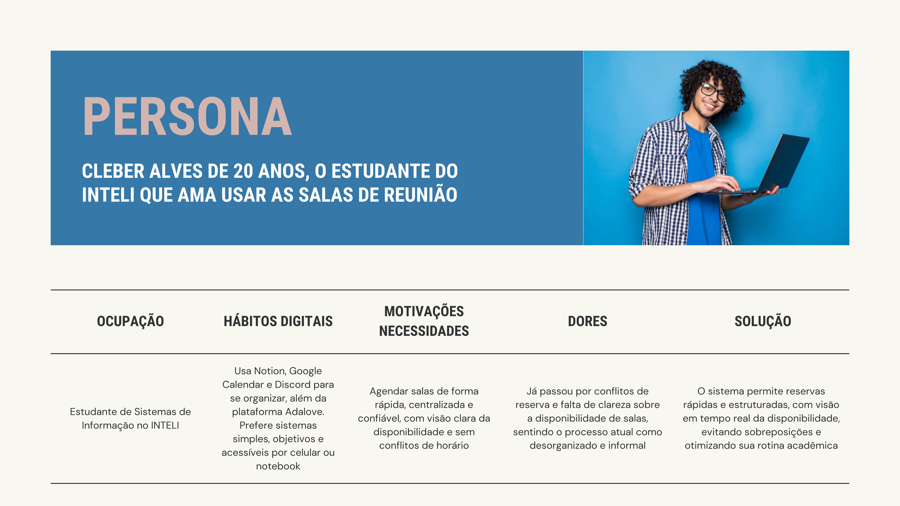

# Web Application Document - Projeto Individual - Módulo 2 - Inteli

**_Os trechos em itálico servem apenas como guia para o preenchimento da seção. Por esse motivo, não devem fazer parte da documentação final._**

## Nome do Projeto

#### Autor do projeto

## Sumário

1. [Introdução](#c1)  
2. [Visão Geral da Aplicação Web](#c2)  
3. [Projeto Técnico da Aplicação Web](#c3)  
4. [Desenvolvimento da Aplicação Web](#c4)  
5. [Referências](#c5)  

<br>

## <a name="c1"></a>1. Introdução:

&nbsp;&nbsp;&nbsp;&nbsp;No contexto inovador do INTELI – Instituto de Tecnologia e Liderança –, onde os projetos acadêmicos refletem diretamente os desafios e demandas do mundo real, este projeto individual propõe o desenvolvimento de um sistema web voltado à reserva de salas para agendamentos. A proposta busca atender, de forma direta, uma necessidade recorrente vivida por alunos da instituição: o uso eficiente, organizado e transparente dos espaços compartilhados no campus.

&nbsp;&nbsp;&nbsp;&nbsp;A plataforma será inteiramente desenvolvida como uma aplicação web responsiva, permitindo que usuários visualizem em tempo real a disponibilidade das salas, façam reservas com base em critérios personalizados (como horário, capacidade, e recursos da sala, como projetores ou lousas) e tenham controle centralizado sobre suas reservas. Isso garante não apenas agilidade no processo, mas também evita conflitos de agendamento e amplia a autonomia dos usuários.

&nbsp;&nbsp;&nbsp;&nbsp;Num primeiro momento, o escopo do projeto será focado em uma implementação funcional básica com banco de dados relacional, backend com APIs REST e frontend interativo. A visão a longo prazo, no entanto, é que o sistema possa ser adotado pelo próprio INTELI como solução para a gestão das salas de reunião existentes em seu campus. Com uma infraestrutura acadêmica moderna de mais de 10 mil m² e múltiplos espaços de convivência, estudo e trabalho colaborativo, a instituição demanda soluções tecnológicas sob medida que acompanhem sua missão de formar líderes através da inovação.
Assim, o projeto alia teoria, prática e propósito institucional, promovendo impacto real e potencial de escalabilidade. Mais que um exercício acadêmico, trata-se de uma aplicação com valor tangível e pronta para ser apresentada como case em processos seletivos e oportunidades profissionais.


---

## <a name="c2"></a>2. Visão Geral da Aplicação Web

### 2.1. Personas:

<div align="center">
<sub>Figura 01 - Persona 01
<br>
<br>
  

  
<sup>Fonte: Material produzido pelo autor (2025)
</div>
<br>

### 2.2. User Stories:

&nbsp;&nbsp;&nbsp;&nbsp;**US01 |** Como estudante do INTELI, quero visualizar em tempo real a disponibilidade das salas, para que eu possa escolher um horário conveniente sem risco de conflito com outras reservas.

&nbsp;&nbsp;&nbsp;&nbsp;**US02 |** Como usuário do sistema, quero realizar reservas filtrando por data, horário, capacidade da sala e recursos disponíveis, para que eu encontre um ambiente adequado às necessidades da minha reunião ou estudo em grupo.

&nbsp;&nbsp;&nbsp;&nbsp;**US03 |** Como estudante, quero acessar uma área pessoal com minhas reservas futuras e passadas, para que eu possa acompanhar, modificar ou cancelar agendamentos conforme minhas demandas mudam.

<br>

**Análise INVEST – User Story US02:**

&nbsp;&nbsp;&nbsp;&nbsp;**US02 |** Como usuário do sistema, quero realizar reservas filtrando por data, horário, capacidade da sala e recursos disponíveis, para que eu encontre um ambiente adequado às necessidades da minha reunião ou estudo em grupo.


&nbsp;&nbsp;&nbsp;&nbsp;**I – Independente:**
Essa User Story pode ser implementada de forma isolada, sem depender diretamente da criação da área pessoal ou visualização de histórico. O filtro e a reserva são funcionalidades autônomas que não exigem que outras partes estejam completamente prontas para funcionar.

&nbsp;&nbsp;&nbsp;&nbsp;**N – Negociável:**
O escopo da filtragem pode ser discutido com os stakeholders. É possível negociar, por exemplo, quais filtros serão priorizados (capacidade, data, recursos, hora) ou se todos precisam estar disponíveis logo na entrega final.

&nbsp;&nbsp;&nbsp;&nbsp;**V – Valiosa:**
Essa funcionalidade agrega valor direto ao usuário, pois garante que ele possa reservar um espaço adequado às suas necessidades. Isso evita frustrações com salas inadequadas e melhora a experiência geral do sistema.

&nbsp;&nbsp;&nbsp;&nbsp;**E – Estimável:**
É possível estimar com clareza o esforço necessário para desenvolver essa funcionalidade. A complexidade pode ser dividida entre a criação do frontend dos filtros, a lógica no backend e a estrutura de dados necessária no banco.

&nbsp;&nbsp;&nbsp;&nbsp;**S – Pequena (Small):**
A User Story é suficientemente pequena para ser entregue em um único ciclo de desenvolvimento. Caso necessário, pode até ser decomposta (ex: primeiro implementar filtro por data e horário, depois adicionar por capacidade e recursos).

&nbsp;&nbsp;&nbsp;&nbsp;**T – Testável:**
É possível validar se a funcionalidade está funcionando corretamente através de testes simples: selecionar filtros específicos e verificar se as salas exibidas condizem com os critérios escolhidos.

---

## <a name="c3"></a>3. Projeto da Aplicação Web

### 3.1. Modelagem do banco de dados:

&nbsp;&nbsp;&nbsp;&nbsp;O sistema de reservas de salas foi modelado para atender às necessidades operacionais e acadêmicas da comunidade do INTELI. A modelagem considera três atores principais: os usuários (que realizam reservas), as salas (disponíveis com recursos variados) e o histórico de alterações (para rastreabilidade). O foco do projeto é garantir integridade, rastreabilidade e evitar conflitos de horário entre as reservas.

O modelo contempla quatro entidades principais:

- Users (Usuários que realizam e alteram reservas);

- Rooms (Salas disponíveis para uso, com descrição e recursos embutidos por atributos booleanos);

- Bookings (Reservas realizadas com data, horário, motivo e status da reserva);

- Booking_History (Histórico de alterações em reservas, incluindo o usuário que modificou, ação e data).

**Modelo Lógico (Relacional):**

&nbsp;&nbsp;&nbsp;&nbsp;As relações entre as entidades estão representadas da seguinte forma:

``` text
[Users] -----< [Bookings] >----- [Rooms]
      \             |
       \            v
        --> [Booking_History]
```

- Um usuário pode fazer várias reservas;

- Uma sala pode ser reservada por vários usuários, em diferentes datas e horários;

- Cada reserva pode registrar alterações realizadas por outros usuários (ex: administradores ou responsáveis), garantindo rastreabilidade no histórico;

- Os atributos booleanos das salas substituem a necessidade de uma tabela separada de recursos, simplificando a modelagem.

&nbsp;&nbsp;&nbsp;&nbsp;A integridade referencial é garantida com o uso de chaves estrangeiras (FK) conectando usuários, salas e reservas. Além disso, foram criadas constraints de exclusividade e verificação para evitar reservas simultâneas e horários inválidos, além de triggers para atualização automática de timestamps.

**Modelo Físico (DDL - Script SQL):**

&nbsp;&nbsp;&nbsp;&nbsp;Abaixo está o esquema completo do banco de dados, pronto para ser executado no Supabase ou em qualquer banco PostgreSQL:

``` sql
-- 1. TABELA: users
CREATE TABLE IF NOT EXISTS users (
    id SERIAL PRIMARY KEY, -- PK
    nome_completo VARCHAR(255) NOT NULL,
    email_institucional VARCHAR(255) NOT NULL UNIQUE,
    senha VARCHAR(255) NOT NULL,
    created_at TIMESTAMP DEFAULT CURRENT_TIMESTAMP,
    updated_at TIMESTAMP DEFAULT CURRENT_TIMESTAMP
);

-- 2. TABELA: rooms
CREATE TABLE IF NOT EXISTS rooms (
    id SERIAL PRIMARY KEY, -- PK
    nome_sala VARCHAR(100) NOT NULL UNIQUE,
    capacidade INTEGER NOT NULL CHECK (capacidade > 0),
    has_tv BOOLEAN DEFAULT FALSE,
    has_whiteboard BOOLEAN DEFAULT FALSE,
    descricao TEXT,
    created_at TIMESTAMP DEFAULT CURRENT_TIMESTAMP,
    updated_at TIMESTAMP DEFAULT CURRENT_TIMESTAMP
);

-- 3. TABELA: bookings
CREATE TABLE IF NOT EXISTS bookings (
    id SERIAL PRIMARY KEY, -- PK
    user_id INTEGER NOT NULL, -- FK → users(id)
    room_id INTEGER NOT NULL, -- FK → rooms(id)
    data_reserva DATE NOT NULL,
    horario_inicio TIME NOT NULL,
    horario_fim TIME NOT NULL,
    motivo_reserva TEXT,
    status_reserva VARCHAR(50) DEFAULT 'confirmada' CHECK (
        status_reserva IN ('confirmada', 'cancelada', 'concluida', 'pendente')
    ),
    created_at TIMESTAMP DEFAULT CURRENT_TIMESTAMP,
    updated_at TIMESTAMP DEFAULT CURRENT_TIMESTAMP,
    CONSTRAINT fk_user_booking FOREIGN KEY (user_id) REFERENCES users(id) ON DELETE CASCADE,
    CONSTRAINT fk_room_booking FOREIGN KEY (room_id) REFERENCES rooms(id) ON DELETE CASCADE,
    CONSTRAINT chk_horario_fim_maior_inicio CHECK (horario_fim > horario_inicio),
    CONSTRAINT unique_user_active_booking_per_day EXCLUDE (
        user_id WITH =, data_reserva WITH =
    ) WHERE (status_reserva IN ('confirmada', 'pendente'))
);

-- 4. TABELA: booking_history
CREATE TABLE IF NOT EXISTS booking_history (
    id SERIAL PRIMARY KEY, -- PK
    booking_id INTEGER NOT NULL, -- FK → bookings(id)
    usuario_modificador_id INTEGER, -- FK → users(id)
    acao_realizada VARCHAR(255) NOT NULL,
    detalhes_alteracao TEXT,
    timestamp_alteracao TIMESTAMP DEFAULT CURRENT_TIMESTAMP,
    CONSTRAINT fk_booking_history FOREIGN KEY (booking_id) REFERENCES bookings(id) ON DELETE CASCADE,
    CONSTRAINT fk_modificador FOREIGN KEY (usuario_modificador_id) REFERENCES users(id)
);

-- 5. ÍNDICES (Para Desempenho)
CREATE INDEX IF NOT EXISTS idx_bookings_user_id ON bookings(user_id);
CREATE INDEX IF NOT EXISTS idx_bookings_room_id ON bookings(room_id);
CREATE INDEX IF NOT EXISTS idx_bookings_data_reserva ON bookings(data_reserva);
CREATE INDEX IF NOT EXISTS idx_booking_history_booking_id ON booking_history(booking_id);

-- 6. Função e triggers para updated_at automático
CREATE OR REPLACE FUNCTION update_updated_at_column()
RETURNS TRIGGER AS $$
BEGIN
   NEW.updated_at = NOW();
   RETURN NEW;
END;
$$ language 'plpgsql';

CREATE TRIGGER trg_users_updated_at
BEFORE UPDATE ON users
FOR EACH ROW EXECUTE PROCEDURE update_updated_at_column();

CREATE TRIGGER trg_rooms_updated_at
BEFORE UPDATE ON rooms
FOR EACH ROW EXECUTE PROCEDURE update_updated_at_column();

CREATE TRIGGER trg_bookings_updated_at
BEFORE UPDATE ON bookings
FOR EACH ROW EXECUTE PROCEDURE update_updated_at_column();
```

**Diagrama Relacional (ERD):**

<div align="center">
<sub>Figura 02 - Diagrama Relacional
<br>
<br>
  

  
<sup>Fonte: Material produzido pelo autor (2025)
</div>
<br>

### 3.1.1 BD e Models (Semana 5)
*Descreva aqui os Models implementados no sistema web*

### 3.2. Arquitetura (Semana 5)

*Posicione aqui o diagrama de arquitetura da sua solução de aplicação web. Atualize sempre que necessário.*

**Instruções para criação do diagrama de arquitetura**  
- **Model**: A camada que lida com a lógica de negócios e interage com o banco de dados.
- **View**: A camada responsável pela interface de usuário.
- **Controller**: A camada que recebe as requisições, processa as ações e atualiza o modelo e a visualização.
  
*Adicione as setas e explicações sobre como os dados fluem entre o Model, Controller e View.*

<br>

### 3.1.1 BD e Models (Semana 5)
*Descreva aqui os Models implementados no sistema web*

### 3.2. Arquitetura (Semana 5)

*Posicione aqui o diagrama de arquitetura da sua solução de aplicação web. Atualize sempre que necessário.*

**Instruções para criação do diagrama de arquitetura**  
- **Model**: A camada que lida com a lógica de negócios e interage com o banco de dados.
- **View**: A camada responsável pela interface de usuário.
- **Controller**: A camada que recebe as requisições, processa as ações e atualiza o modelo e a visualização.
  
*Adicione as setas e explicações sobre como os dados fluem entre o Model, Controller e View.*

<br>

### 3.3. Wireframes (Semana 03)

*Posicione aqui as imagens do wireframe construído para sua solução e, opcionalmente, o link para acesso (mantenha o link sempre público para visualização).*

### 3.4. Guia de estilos (Semana 05)

*Descreva aqui orientações gerais para o leitor sobre como utilizar os componentes do guia de estilos de sua solução.*


### 3.5. Protótipo de alta fidelidade (Semana 05)

*Posicione aqui algumas imagens demonstrativas de seu protótipo de alta fidelidade e o link para acesso ao protótipo completo (mantenha o link sempre público para visualização).*

### 3.6. WebAPI e endpoints (Semana 05)

*Utilize um link para outra página de documentação contendo a descrição completa de cada endpoint. Ou descreva aqui cada endpoint criado para seu sistema.*  

### 3.7 Interface e Navegação (Semana 07)

*Descreva e ilustre aqui o desenvolvimento do frontend do sistema web, explicando brevemente o que foi entregue em termos de código e sistema. Utilize prints de tela para ilustrar.*

---

## <a name="c4"></a>4. Desenvolvimento da Aplicação Web (Semana 8)

### 4.1 Demonstração do Sistema Web (Semana 8)

*VIDEO: Insira o link do vídeo demonstrativo nesta seção*
*Descreva e ilustre aqui o desenvolvimento do sistema web completo, explicando brevemente o que foi entregue em termos de código e sistema. Utilize prints de tela para ilustrar.*

### 4.2 Conclusões e Trabalhos Futuros (Semana 8)

*Indique pontos fortes e pontos a melhorar de maneira geral.*
*Relacione também quaisquer outras ideias que você tenha para melhorias futuras.*


## <a name="c5"></a>5. Referências

_Incluir as principais referências de seu projeto, para que seu parceiro possa consultar caso ele se interessar em aprofundar. Um exemplo de referência de livro e de site:_<br>

---
---
