# Web Application Document - Projeto Individual - Módulo 2 - Inteli

## Sistema de Reservas de Salas INTELI

#### Matheus Henrique Scapolan Silva

## Sumário

1. [Introdução](#c1)  
2. [Visão Geral da Aplicação Web](#c2)  
3. [Projeto Técnico da Aplicação Web](#c3)  
4. [Desenvolvimento da Aplicação Web](#c4)  
5. [Referências](#c5)  

<br>

## <a name="c1"></a>1. Introdução:

&nbsp;&nbsp;&nbsp;&nbsp;No contexto inovador do INTELI – Instituto de Tecnologia e Liderança –, onde os projetos acadêmicos refletem diretamente os desafios e demandas do mundo real, este projeto individual propõe o desenvolvimento de um sistema web voltado à reserva de salas para agendamentos. A proposta busca atender, de forma direta, uma necessidade recorrente vivida por alunos da instituição: o uso eficiente, organizado e transparente dos espaços compartilhados no campus.

&nbsp;&nbsp;&nbsp;&nbsp;A plataforma será inteiramente desenvolvida como uma aplicação web responsiva, permitindo que usuários visualizem em tempo real a disponibilidade das salas, façam reservas com base em critérios personalizados (como horário, capacidade, e recursos da sala, como projetores ou lousas) e tenham controle centralizado sobre suas reservas. Isso garante não apenas agilidade no processo, mas também evita conflitos de agendamento e amplia a autonomia dos usuários.

&nbsp;&nbsp;&nbsp;&nbsp;Num primeiro momento, o escopo do projeto será focado em uma implementação funcional básica com banco de dados relacional, backend com APIs REST e frontend interativo. A visão a longo prazo, no entanto, é que o sistema possa ser adotado pelo próprio INTELI como solução para a gestão das salas de reunião existentes em seu campus. Com uma infraestrutura acadêmica moderna de mais de 10 mil m² e múltiplos espaços de convivência, estudo e trabalho colaborativo, a instituição demanda soluções tecnológicas sob medida que acompanhem sua missão de formar líderes através da inovação.
Assim, o projeto alia teoria, prática e propósito institucional, promovendo impacto real e potencial de escalabilidade. Mais que um exercício acadêmico, trata-se de uma aplicação com valor tangível e pronta para ser apresentada como case em processos seletivos e oportunidades profissionais.


---

## <a name="c2"></a>2. Visão Geral da Aplicação Web

### 2.1. Personas:

<div align="center">
<sub>Figura 01 - Persona 01
<br>
<br>
  

  
<sup>Fonte: Material produzido pelo autor (2025)
</div>
<br>

### 2.2. User Stories:

&nbsp;&nbsp;&nbsp;&nbsp;**US01 |** Como estudante do INTELI, quero visualizar em tempo real a disponibilidade das salas, para que eu possa escolher um horário conveniente sem risco de conflito com outras reservas.

&nbsp;&nbsp;&nbsp;&nbsp;**US02 |** Como usuário do sistema, quero realizar reservas filtrando por data, horário, capacidade da sala e recursos disponíveis, para que eu encontre um ambiente adequado às necessidades da minha reunião ou estudo em grupo.

&nbsp;&nbsp;&nbsp;&nbsp;**US03 |** Como estudante, quero acessar uma área pessoal com minhas reservas futuras e passadas, para que eu possa acompanhar, modificar ou cancelar agendamentos conforme minhas demandas mudam.

<br>

**Análise INVEST – User Story US02:**

&nbsp;&nbsp;&nbsp;&nbsp;**US02 |** Como usuário do sistema, quero realizar reservas filtrando por data, horário, capacidade da sala e recursos disponíveis, para que eu encontre um ambiente adequado às necessidades da minha reunião ou estudo em grupo.


&nbsp;&nbsp;&nbsp;&nbsp;**I – Independente:**
Essa User Story pode ser implementada de forma isolada, sem depender diretamente da criação da área pessoal ou visualização de histórico. O filtro e a reserva são funcionalidades autônomas que não exigem que outras partes estejam completamente prontas para funcionar.

&nbsp;&nbsp;&nbsp;&nbsp;**N – Negociável:**
O escopo da filtragem pode ser discutido com os stakeholders. É possível negociar, por exemplo, quais filtros serão priorizados (capacidade, data, recursos, hora) ou se todos precisam estar disponíveis logo na entrega final.

&nbsp;&nbsp;&nbsp;&nbsp;**V – Valiosa:**
Essa funcionalidade agrega valor direto ao usuário, pois garante que ele possa reservar um espaço adequado às suas necessidades. Isso evita frustrações com salas inadequadas e melhora a experiência geral do sistema.

&nbsp;&nbsp;&nbsp;&nbsp;**E – Estimável:**
É possível estimar com clareza o esforço necessário para desenvolver essa funcionalidade. A complexidade pode ser dividida entre a criação do frontend dos filtros, a lógica no backend e a estrutura de dados necessária no banco.

&nbsp;&nbsp;&nbsp;&nbsp;**S – Pequena (Small):**
A User Story é suficientemente pequena para ser entregue em um único ciclo de desenvolvimento. Caso necessário, pode até ser decomposta (ex: primeiro implementar filtro por data e horário, depois adicionar por capacidade e recursos).

&nbsp;&nbsp;&nbsp;&nbsp;**T – Testável:**
É possível validar se a funcionalidade está funcionando corretamente através de testes simples: selecionar filtros específicos e verificar se as salas exibidas condizem com os critérios escolhidos.

---

## <a name="c3"></a>3. Projeto da Aplicação Web

### 3.1. Modelagem do banco de dados:

&nbsp;&nbsp;&nbsp;&nbsp;O sistema de reservas de salas foi modelado para atender às necessidades operacionais e acadêmicas da comunidade do INTELI. A modelagem considera três atores principais: os usuários (que realizam reservas), as salas (disponíveis com recursos variados) e o histórico de alterações (para rastreabilidade). O foco do projeto é garantir integridade, rastreabilidade e evitar conflitos de horário entre as reservas.

O modelo contempla quatro entidades principais:

- Users (Usuários que realizam e alteram reservas);

- Rooms (Salas disponíveis para uso, com descrição e recursos embutidos por atributos booleanos);

- Bookings (Reservas realizadas com data, horário, motivo e status da reserva);

- Booking_History (Histórico de alterações em reservas, incluindo o usuário que modificou, ação e data).

**Modelo Lógico (Relacional):**

&nbsp;&nbsp;&nbsp;&nbsp;As relações entre as entidades estão representadas da seguinte forma:

``` text
[Users] -----< [Bookings] >----- [Rooms]
      \             |
       \            v
        --> [Booking_History]
```

- Um usuário pode fazer várias reservas;

- Uma sala pode ser reservada por vários usuários, em diferentes datas e horários;

- Cada reserva pode registrar alterações realizadas por outros usuários (ex: administradores ou responsáveis), garantindo rastreabilidade no histórico;

- Os atributos booleanos das salas substituem a necessidade de uma tabela separada de recursos, simplificando a modelagem.

&nbsp;&nbsp;&nbsp;&nbsp;A integridade referencial é garantida com o uso de chaves estrangeiras (FK) conectando usuários, salas e reservas. Além disso, foram criadas constraints de exclusividade e verificação para evitar reservas simultâneas e horários inválidos, além de triggers para atualização automática de timestamps.

**Modelo Físico (DDL - Script SQL):**

&nbsp;&nbsp;&nbsp;&nbsp;Abaixo está o esquema completo do banco de dados, pronto para ser executado no Supabase ou em qualquer banco PostgreSQL:

``` sql
-- 1. TABELA: users
CREATE TABLE IF NOT EXISTS users (
    id SERIAL PRIMARY KEY, -- PK
    nome_completo VARCHAR(255) NOT NULL,
    email_institucional VARCHAR(255) NOT NULL UNIQUE,
    senha VARCHAR(255) NOT NULL,
    created_at TIMESTAMP DEFAULT CURRENT_TIMESTAMP,
    updated_at TIMESTAMP DEFAULT CURRENT_TIMESTAMP
);

-- 2. TABELA: rooms
CREATE TABLE IF NOT EXISTS rooms (
    id SERIAL PRIMARY KEY, -- PK
    nome_sala VARCHAR(100) NOT NULL UNIQUE,
    capacidade INTEGER NOT NULL CHECK (capacidade > 0),
    has_tv BOOLEAN DEFAULT FALSE,
    has_whiteboard BOOLEAN DEFAULT FALSE,
    descricao TEXT,
    created_at TIMESTAMP DEFAULT CURRENT_TIMESTAMP,
    updated_at TIMESTAMP DEFAULT CURRENT_TIMESTAMP
);

-- 3. TABELA: bookings
CREATE TABLE IF NOT EXISTS bookings (
    id SERIAL PRIMARY KEY, -- PK
    user_id INTEGER NOT NULL, -- FK → users(id)
    room_id INTEGER NOT NULL, -- FK → rooms(id)
    data_reserva DATE NOT NULL,
    horario_inicio TIME NOT NULL,
    horario_fim TIME NOT NULL,
    motivo_reserva TEXT,
    status_reserva VARCHAR(50) DEFAULT 'confirmada' CHECK (
        status_reserva IN ('confirmada', 'cancelada', 'concluida', 'pendente')
    ),
    created_at TIMESTAMP DEFAULT CURRENT_TIMESTAMP,
    updated_at TIMESTAMP DEFAULT CURRENT_TIMESTAMP,
    CONSTRAINT fk_user_booking FOREIGN KEY (user_id) REFERENCES users(id) ON DELETE CASCADE,
    CONSTRAINT fk_room_booking FOREIGN KEY (room_id) REFERENCES rooms(id) ON DELETE CASCADE,
    CONSTRAINT chk_horario_fim_maior_inicio CHECK (horario_fim > horario_inicio),
    CONSTRAINT unique_user_active_booking_per_day EXCLUDE (
        user_id WITH =, data_reserva WITH =
    ) WHERE (status_reserva IN ('confirmada', 'pendente'))
);

-- 4. TABELA: booking_history
CREATE TABLE IF NOT EXISTS booking_history (
    id SERIAL PRIMARY KEY, -- PK
    booking_id INTEGER NOT NULL, -- FK → bookings(id)
    usuario_modificador_id INTEGER, -- FK → users(id)
    acao_realizada VARCHAR(255) NOT NULL,
    detalhes_alteracao TEXT,
    timestamp_alteracao TIMESTAMP DEFAULT CURRENT_TIMESTAMP,
    CONSTRAINT fk_booking_history FOREIGN KEY (booking_id) REFERENCES bookings(id) ON DELETE CASCADE,
    CONSTRAINT fk_modificador FOREIGN KEY (usuario_modificador_id) REFERENCES users(id)
);

-- 5. ÍNDICES (Para Desempenho)
CREATE INDEX IF NOT EXISTS idx_bookings_user_id ON bookings(user_id);
CREATE INDEX IF NOT EXISTS idx_bookings_room_id ON bookings(room_id);
CREATE INDEX IF NOT EXISTS idx_bookings_data_reserva ON bookings(data_reserva);
CREATE INDEX IF NOT EXISTS idx_booking_history_booking_id ON booking_history(booking_id);

-- 6. Função e triggers para updated_at automático
CREATE OR REPLACE FUNCTION update_updated_at_column()
RETURNS TRIGGER AS $$
BEGIN
   NEW.updated_at = NOW();
   RETURN NEW;
END;
$$ language 'plpgsql';

CREATE TRIGGER trg_users_updated_at
BEFORE UPDATE ON users
FOR EACH ROW EXECUTE PROCEDURE update_updated_at_column();

CREATE TRIGGER trg_rooms_updated_at
BEFORE UPDATE ON rooms
FOR EACH ROW EXECUTE PROCEDURE update_updated_at_column();

CREATE TRIGGER trg_bookings_updated_at
BEFORE UPDATE ON bookings
FOR EACH ROW EXECUTE PROCEDURE update_updated_at_column();

SET TIMEZONE TO 'America/Sao_Paulo';
```

**Diagrama Relacional (ERD):**

<div align="center">
<sub>Figura 02 - Diagrama Relacional
<br>
<br>
  

  
<sup>Fonte: Material produzido pelo autor (2025)
</div>
<br>

### 3.1.1 BD e Models

O Sistema de Reservas INTELI implementa uma arquitetura de dados baseada em modelos bem definidos que encapsulam a lógica de negócio e o acesso aos dados. O sistema utiliza uma abordagem híbrida, com modelos preparados tanto para persistência em arquivos JSON (implementação atual) quanto para bancos de dados relacionais (PostgreSQL), garantindo flexibilidade e escalabilidade.

#### 3.1.1.1 Arquitetura de Persistência

**Database.js - Gerenciador Central de Dados**

O arquivo `Database.js` atua como o núcleo do sistema de persistência, implementando o padrão Singleton para garantir uma única instância de acesso aos dados. Esta classe centraliza o gerenciamento de todas as entidades do sistema:

```javascript
class Database {
  constructor() {
    this.dataDir = path.join(__dirname, '..', 'data');
    this.initializeDataFiles();
    this.loadInteliRooms();

    // Inicializar gerenciadores de entidades
    this.rooms = new RoomManager(this);
    this.users = new UserManager(this);
    this.bookings = new BookingManager(this);
    this.bookingHistory = new BookingHistoryManager(this);
  }
}
```

**Características Principais:**
- **Inicialização Automática**: Cria automaticamente os arquivos de dados se não existirem
- **Dados Pré-carregados**: Inclui salas reais do INTELI e usuários administradores padrão
- **Gerenciadores Especializados**: Cada entidade possui seu próprio gerenciador com métodos específicos
- **Integridade Referencial**: Validações para manter a consistência dos dados

#### 3.1.1.2 Models Implementados

**1. User Model (UserManager)**

Responsável pelo gerenciamento de usuários do sistema, incluindo autenticação e autorização.

**Estrutura de Dados:**
```javascript
{
  id: Number,           // Identificador único
  name: String,         // Nome completo do usuário
  email: String,        // Email institucional (@sou.inteli.edu.br)
  password: String,     // Senha criptografada com bcrypt
  role: String,         // Papel do usuário ('user' ou 'admin')
  createdAt: Date       // Data de criação
}
```

**Métodos Principais:**
- `create(userData)`: Cria novo usuário com validação de email e criptografia de senha
- `getByEmail(email)`: Busca usuário por email para autenticação
- `getById(id)`: Recupera usuário por ID
- `getAll()`: Lista todos os usuários (apenas admin)
- `update(id, userData)`: Atualiza dados do usuário
- `delete(id)`: Remove usuário do sistema

**Validações Implementadas:**
- Email deve terminar com `@sou.inteli.edu.br` ou `@inteli.edu.br`
- Senha é automaticamente criptografada com bcrypt (salt 10)
- Verificação de unicidade de email
- Validação de campos obrigatórios

**2. Room Model (RoomManager)**

Gerencia as salas disponíveis no INTELI com suas características e recursos.

**Estrutura de Dados:**
```javascript
{
  id: Number,           // Identificador único da sala
  name: String,         // Nome/código da sala (ex: "R03", "Auditório")
  capacity: Number,     // Capacidade máxima de pessoas
  location: String,     // Localização física (ex: "Térreo", "1º Andar")
  resources: String,    // Recursos disponíveis (ex: "TV, Lousa, Projetor")
  description: String,  // Descrição adicional da sala
  createdAt: Date      // Data de criação
}
```

**Métodos Principais:**
- `getAll()`: Lista todas as salas disponíveis
- `getById(id)`: Recupera sala específica por ID
- `filter({ capacity, resources })`: Filtra salas por capacidade e recursos
- `create(roomData)`: Cria nova sala (apenas admin)
- `update(id, roomData)`: Atualiza dados da sala (apenas admin)
- `delete(id)`: Remove sala do sistema (apenas admin)

**Funcionalidades Especiais:**
- **Filtro por Capacidade**: Permite buscar salas com capacidade mínima/máxima
- **Filtro por Recursos**: Busca salas que possuem recursos específicos
- **Dados Pré-carregados**: Inclui salas reais do INTELI (R01-R10, C01-C04, etc.)

**3. Booking Model (BookingManager)**

Núcleo do sistema, gerencia todas as reservas com validações complexas e regras de negócio.

**Estrutura de Dados:**
```javascript
{
  id: Number,           // Identificador único da reserva
  userId: Number,       // ID do usuário que fez a reserva
  roomId: Number,       // ID da sala reservada
  date: String,         // Data da reserva (YYYY-MM-DD)
  startTime: String,    // Horário de início (HH:MM)
  endTime: String,      // Horário de término (HH:MM)
  purpose: String,      // Finalidade da reserva
  attendees: Number,    // Número de participantes
  status: String,       // Status ('confirmed', 'cancelled', 'completed')
  createdAt: Date      // Data de criação
}
```

**Métodos Principais:**
- `create(bookingData)`: Cria nova reserva com validações completas
- `getByUser(userId)`: Lista reservas de um usuário específico
- `getByRoom(roomId)`: Lista reservas de uma sala específica
- `getByDate(date)`: Lista reservas de uma data específica
- `checkAvailability(roomId, date, startTime, endTime)`: Verifica disponibilidade
- `hasActiveBookingOnDate(userId, date)`: Verifica se usuário já tem reserva na data
- `update(id, bookingData)`: Atualiza reserva com revalidação
- `cancel(id)`: Cancela reserva e move para histórico

**Validações e Regras de Negócio:**
- **Conflito de Horários**: Impede sobreposição de reservas na mesma sala
- **Uma Reserva por Dia**: Usuário pode ter apenas uma reserva ativa por data
- **Capacidade da Sala**: Número de participantes não pode exceder capacidade
- **Horário Válido**: Horário de fim deve ser posterior ao de início
- **Data Futura**: Não permite reservas em datas passadas

**4. BookingHistory Model (BookingHistoryManager)**

Mantém histórico completo de todas as reservas finalizadas ou canceladas, garantindo rastreabilidade.

**Estrutura de Dados:**
```javascript
{
  id: Number,                    // Identificador único do histórico
  originalBookingId: Number,     // ID da reserva original
  userId: Number,                // ID do usuário
  roomId: Number,                // ID da sala
  date: String,                  // Data da reserva
  startTime: String,             // Horário de início
  endTime: String,               // Horário de término
  purpose: String,               // Finalidade da reserva
  attendees: Number,             // Número de participantes
  status: String,                // Status final ('completed', 'cancelled')
  expiredAt: Date,               // Quando a reserva expirou
  movedToHistoryAt: Date        // Quando foi movida para histórico
}
```

**Métodos Principais:**
- `getAll()`: Lista todo o histórico (apenas admin)
- `getByUser(userId)`: Histórico de um usuário específico
- `getByRoom(roomId)`: Histórico de uma sala específica
- `getByDate(date)`: Histórico de uma data específica
- `getByOriginalBooking(bookingId)`: Histórico de uma reserva específica
- `getStats()`: Estatísticas do histórico (total, completadas, canceladas)
- `create(historyData)`: Adiciona entrada ao histórico

**Funcionalidades Especiais:**
- **Rastreabilidade Completa**: Mantém todos os dados originais da reserva
- **Timestamps Detalhados**: Registra quando expirou e quando foi movida
- **Estatísticas**: Fornece métricas para análise de uso
- **Enriquecimento de Dados**: Adiciona informações de sala e usuário automaticamente

#### 3.1.1.3 Padrões e Boas Práticas Implementadas

**1. Entity Manager Pattern**
Todos os modelos herdam de uma classe base `EntityManager` que fornece operações CRUD padronizadas:

```javascript
class EntityManager {
  constructor(db, entityName) {
    this.db = db;
    this.entityName = entityName;
    this.filePath = path.join(db.dataDir, `${entityName}.json`);
  }

  getAll() { /* Implementação genérica */ }
  getById(id) { /* Implementação genérica */ }
  create(data) { /* Implementação genérica */ }
  update(id, data) { /* Implementação genérica */ }
  delete(id) { /* Implementação genérica */ }
}
```

**2. Data Validation**
- Validação de tipos de dados
- Verificação de campos obrigatórios
- Validação de regras de negócio específicas
- Sanitização de entrada de dados

**3. Error Handling**
- Tratamento consistente de erros
- Mensagens de erro descritivas
- Logging de erros para debugging
- Retorno de códigos HTTP apropriados

**4. Data Integrity**
- Verificação de integridade referencial
- Prevenção de estados inconsistentes
- Transações atômicas (simuladas)
- Backup automático de dados

### 3.2. Arquitetura

O Sistema de Reservas INTELI foi desenvolvido seguindo rigorosamente o padrão arquitetural **MVC (Model-View-Controller)**, garantindo separação clara de responsabilidades, manutenibilidade e escalabilidade. A arquitetura implementada promove baixo acoplamento entre as camadas e alta coesão dentro de cada componente.

#### 3.2.1 Visão Geral da Arquitetura

A aplicação segue uma arquitetura em camadas bem definidas, onde cada camada tem responsabilidades específicas e se comunica com as outras através de interfaces bem estabelecidas:

```mermaid
graph TB
    %% Camada de Apresentação (View)
    subgraph "VIEW LAYER"
        Views[Views - EJS Templates]
        Views --> LoginView[login.ejs]
        Views --> DashboardView[index.ejs]
        Views --> RoomsView[rooms.ejs]
        Views --> BookingsView[bookings.ejs]
        Views --> BookingDetailsView[booking-details.ejs]
        Views --> Partials[partials/header.ejs<br/>partials/footer.ejs]
    end

    %% Camada de Controle (Controller)
    subgraph "CONTROLLER LAYER"
        Controllers[Controllers]
        Controllers --> AuthController[Auth Controller<br/>- register()<br/>- login()<br/>- verifyToken()]
        Controllers --> RoomController[Room Controller<br/>- getAll()<br/>- getById()<br/>- filter()]
        Controllers --> BookingController[Booking Controller<br/>- create()<br/>- getByUser()<br/>- cancel()]
        Controllers --> HistoryController[History Controller<br/>- getAll()<br/>- getByUser()]
    end

    %% Camada de Modelo (Model)
    subgraph "MODEL LAYER"
        Database[Database.js<br/>Singleton Manager]
        Database --> UserManager[User Manager<br/>- Authentication<br/>- User CRUD]
        Database --> RoomManager[Room Manager<br/>- Room CRUD<br/>- Filtering]
        Database --> BookingManager[Booking Manager<br/>- Booking CRUD<br/>- Availability Check]
        Database --> HistoryManager[History Manager<br/>- History CRUD<br/>- Statistics]
    end

    %% Camada de Persistência
    subgraph "PERSISTENCE LAYER"
        DataFiles[JSON Data Files]
        DataFiles --> UsersJSON[users.json]
        DataFiles --> RoomsJSON[rooms.json]
        DataFiles --> BookingsJSON[bookings.json]
        DataFiles --> HistoryJSON[history.json]
    end

    %% Middlewares e Serviços
    subgraph "MIDDLEWARE & SERVICES"
        AuthMiddleware[Authentication<br/>Middleware]
        ExpirationService[Booking Expiration<br/>Service]
        Routes[Express Routes<br/>API & Web]
    end

    %% Fluxo de Dados
    Views -.->|HTTP Requests| Routes
    Routes -->|Route to| Controllers
    Controllers -->|Business Logic| Database
    Database -->|Data Access| DataFiles

    %% Middleware Integration
    Routes -->|Authentication| AuthMiddleware
    Controllers -->|Auto Expiration| ExpirationService

    %% Response Flow
    DataFiles -.->|Data| Database
    Database -.->|Processed Data| Controllers
    Controllers -.->|Response Data| Views
```

#### 3.2.2 Detalhamento das Camadas

**CAMADA MODEL (Modelo)**

A camada Model é responsável pela lógica de negócio e acesso aos dados, implementada através de gerenciadores especializados:

**Responsabilidades:**
- Encapsular regras de negócio específicas do domínio
- Gerenciar persistência e recuperação de dados
- Validar integridade e consistência dos dados
- Implementar operações CRUD para cada entidade
- Manter estado da aplicação

**Componentes Principais:**

1. **Database.js (Singleton Manager)**
   - Ponto central de acesso aos dados
   - Inicialização e configuração do sistema de persistência
   - Coordenação entre diferentes gerenciadores de entidade
   - Garantia de integridade referencial

2. **UserManager**
   - Autenticação e autorização de usuários
   - Criptografia de senhas com bcrypt
   - Validação de emails institucionais
   - Gerenciamento de perfis e roles

3. **RoomManager**
   - Gerenciamento de salas e recursos
   - Filtros avançados por capacidade e recursos
   - Validação de dados de salas
   - Manutenção de catálogo de salas do INTELI

4. **BookingManager**
   - Lógica complexa de reservas
   - Verificação de disponibilidade em tempo real
   - Validação de conflitos de horário
   - Regras de negócio (uma reserva por usuário por dia)
   - Processamento de expiração automática

5. **BookingHistoryManager**
   - Manutenção de histórico completo
   - Rastreabilidade de alterações
   - Geração de estatísticas e relatórios
   - Arquivamento de reservas finalizadas

**CAMADA CONTROLLER (Controlador)**

Os Controllers atuam como intermediários entre as Views e Models, processando requisições e coordenando respostas:

**Responsabilidades:**
- Receber e processar requisições HTTP
- Validar dados de entrada
- Coordenar chamadas aos Models apropriados
- Formatar respostas para as Views
- Implementar lógica de autorização
- Tratamento de erros e exceções

**Componentes Principais:**

1. **AuthController**
   ```javascript
   class AuthController {
     static async register(req, res) {
       // Validação de dados
       // Criptografia de senha
       // Criação de usuário via UserManager
       // Geração de JWT token
       // Resposta formatada
     }

     static async login(req, res) {
       // Validação de credenciais
       // Verificação de senha
       // Geração de token JWT
       // Resposta com dados do usuário
     }
   }
   ```

2. **RoomController**
   ```javascript
   class RoomController {
     static async getAll(req, res) {
       // Recuperação de todas as salas
       // Formatação de resposta
     }

     static async filter(req, res) {
       // Processamento de filtros
       // Chamada ao RoomManager
       // Retorno de salas filtradas
     }
   }
   ```

3. **BookingController**
   ```javascript
   class BookingController {
     static async create(req, res) {
       // Validação de dados da reserva
       // Verificação de disponibilidade
       // Criação via BookingManager
       // Resposta de confirmação
     }

     static async cancel(req, res) {
       // Verificação de permissões
       // Cancelamento da reserva
       // Movimentação para histórico
     }
   }
   ```

**CAMADA VIEW (Visão)**

A camada View é responsável pela apresentação dos dados e interação com o usuário:

**Responsabilidades:**
- Renderização de templates EJS
- Apresentação de dados formatados
- Captura de entrada do usuário
- Implementação de interface responsiva
- Validação client-side
- Feedback visual para o usuário

**Componentes Principais:**

1. **Templates EJS**
   - `login.ejs`: Interface de autenticação
   - `index.ejs`: Dashboard principal
   - `rooms.ejs`: Listagem e filtros de salas
   - `bookings.ejs`: Gerenciamento de reservas
   - `booking-details.ejs`: Detalhes de reserva específica

2. **Partials Reutilizáveis**
   - `header.ejs`: Navegação e branding
   - `footer.ejs`: Informações institucionais

3. **Assets Estáticos**
   - CSS customizado seguindo Design System INTELI
   - JavaScript para interatividade
   - Imagens e recursos visuais

#### 3.2.3 Fluxo de Dados na Arquitetura

**1. Requisição do Usuário (Request Flow)**
```
User Action → HTTP Request → Express Routes → Middleware → Controller → Model → Database
```

**2. Processamento e Resposta (Response Flow)**
```
Database → Model → Controller → View Template → HTTP Response → User Interface
```

**3. Exemplo Prático - Criação de Reserva:**

1. **View**: Usuário preenche formulário de reserva
2. **Route**: `POST /api/bookings` captura requisição
3. **Middleware**: Verifica autenticação JWT
4. **Controller**: `BookingController.create()` processa dados
5. **Model**: `BookingManager` valida disponibilidade
6. **Database**: Persiste nova reserva em `bookings.json`
7. **Response**: Controller retorna confirmação
8. **View**: Interface atualiza com feedback visual

#### 3.2.4 Padrões Arquiteturais Implementados

**1. Singleton Pattern**
- `Database.js` garante única instância de acesso aos dados
- Evita inconsistências e conflitos de acesso

**2. Factory Pattern**
- Gerenciadores de entidade criados dinamicamente
- Facilita extensão para novas entidades

**3. Middleware Pattern**
- Autenticação JWT como middleware
- Logging e tratamento de erros centralizados

**4. Repository Pattern**
- Cada Manager atua como repository para sua entidade
- Abstrai detalhes de persistência

**5. Service Layer Pattern**
- `BookingExpirationService` para lógica especializada
- Separação de responsabilidades complexas

#### 3.2.5 Benefícios da Arquitetura Implementada

**Manutenibilidade:**
- Separação clara de responsabilidades
- Código modular e reutilizável
- Facilidade para debugging e testes

**Escalabilidade:**
- Fácil adição de novas funcionalidades
- Possibilidade de migração para microserviços
- Suporte a diferentes tipos de persistência

**Testabilidade:**
- Cada camada pode ser testada independentemente
- Mocks e stubs facilmente implementáveis
- Cobertura de testes abrangente

**Flexibilidade:**
- Mudanças em uma camada não afetam as outras
- Diferentes implementações de persistência
- Adaptação a novos requisitos

<br>

### 3.3. Wireframes

Nesta seção, é apresentado os wireframes desenvolvidos para o sistema de Reserva de Salas do INTELI. Os wireframes focam na estrutura, navegação e disposição dos elementos da interface do usuário, refletindo as funcionalidades essenciais para uma experiência de usuário intuitiva e eficiente. O design prioriza a clareza e a facilidade de uso, garantindo que os usuários possam realizar suas tarefas de forma rápida e sem ambiguidades. As telas foram concebidas para atender às necessidades identificadas, proporcionando um fluxo lógico e coeso através das diversas funcionalidades do sistema.

É importante ressaltar que os wireframes apresentados são de baixa fidelidade, concentrando-se na arquitetura da informação e na funcionalidade, sem detalhamento de cores, estilos visuais finais, tipografias específicas ou imagens realistas, conforme as boas práticas de desenvolvimento de wireframes nesta fase do projeto. O objetivo principal é validar a estrutura e o fluxo de navegação antes de avançar para etapas de design de alta fidelidade.

As telas obrigatórias, como a tela principal de uso e telas de interação com funcionalidades centrais, estão contempladas. A seguir, cada wireframe é apresentado com uma descrição detalhada de seus componentes e a lógica de interação proposta.

### 3.3.1 Tela de Login

**Link do Figma:**

&nbsp;&nbsp;&nbsp;&nbsp; Abaixo está o link do Figma para a consulta dos Wireframes.

https://www.figma.com/design/8Yfo0P6Ow169ZiPUmhe3Be/Sistema-Reservas?node-id=0-1&p=f&m=draw

<div align="center">
<sub>Figura 03 - Tela de Login
<br>
<br>
  
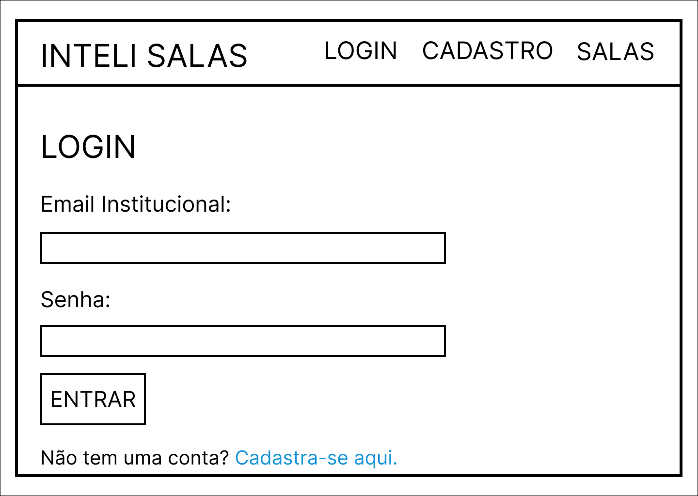
  
<sup>Fonte: Material produzido pelo autor (2025)
</div>
<br>

**Descrição:** A tela de login é a porta de entrada para o sistema, garantindo que apenas usuários autenticados tenham acesso às funcionalidades. Ela apresenta campos para inserção de email e senha, além de um botão para "Entrar". Há também um link para cadastro de novos usuários.

**Elementos:**

*   **Campo de Email:** Permite ao usuário inserir seu endereço de email cadastrado.
*   **Campo de Senha:** Permite ao usuário inserir sua senha.
*   **Botão "Entrar":** Ao ser clicado, valida as credenciais e, se corretas, direciona o usuário para a tela principal do sistema (Dashboard).
*   **Link "Cadastre-se":** Leva o usuário para a tela de cadastro, permitindo a criação de uma nova conta.

**Fluxo de Interação:**

1.  O usuário acessa a tela de login.
2.  Insere seu email e senha nos campos correspondentes.
3.  Clica no botão "Entrar".
4.  O sistema verifica as credenciais.
5.  Se as credenciais estiverem corretas, o usuário é redirecionado para a tela principal (Dashboard).
6.  Se as credenciais estiverem incorretas, uma mensagem de erro é exibida, e o usuário permanece na tela de login.
7.  Caso o usuário não possua uma conta, ele pode clicar no link "Cadastre-se" para ser direcionado à tela de cadastro.

**User Stories Atendidas:**

*   Como usuário, eu quero poder me logar no sistema para acessar minhas informações e funcionalidades.
*   Como novo usuário, eu quero poder me cadastrar no sistema para começar a utilizá-lo.

### 3.3.2 Tela de Cadastro de Usuário

<div align="center">
<sub>Figura 04 - Tela de Login
<br>
<br>
  
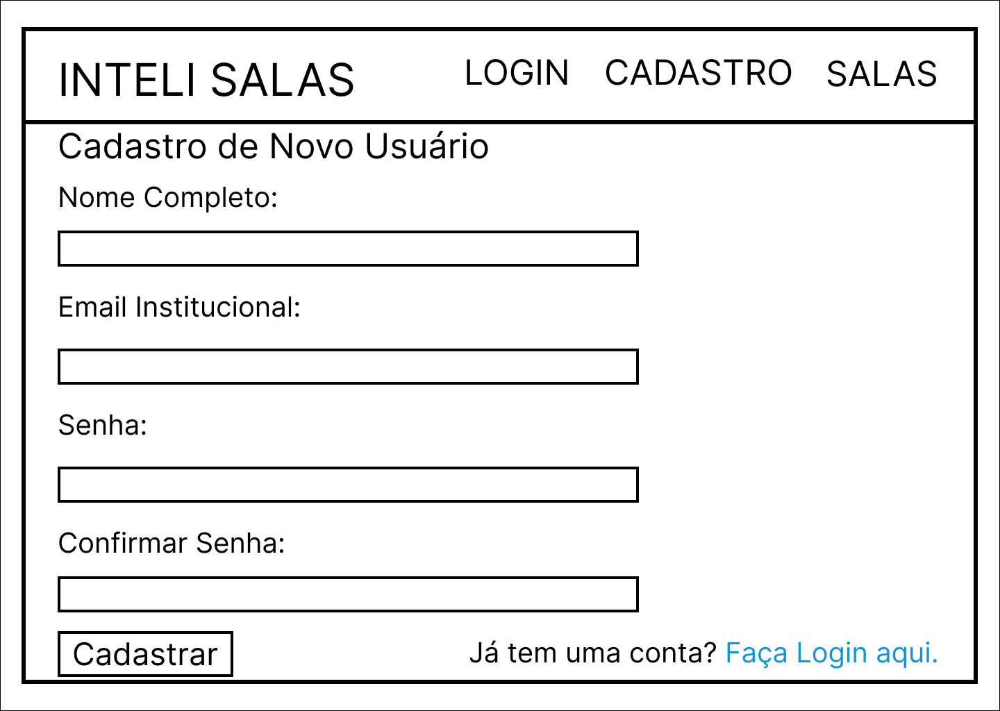
  
<sup>Fonte: Material produzido pelo autor (2025)
</div>
<br>

**Descrição:** A tela de cadastro permite que novos usuários criem uma conta no sistema, fornecendo informações básicas para identificação e acesso.

**Elementos:**

*   **Campo "Nome Completo":** Para o usuário inserir seu nome completo.
*   **Campo "Email Institucional":** Para o usuário inserir seu email institucional, que será usado como login.
*   **Campo "Senha":** Para o usuário definir uma senha para sua conta.
*   **Campo "Confirmar Senha":** Para o usuário confirmar a senha digitada anteriormente, garantindo que não houve erros de digitação.
*   **Botão "Cadastrar":** Submete os dados do formulário para criar a nova conta.
*   **Link "Já tem uma conta? Faça login aqui.":** Redireciona o usuário para a tela de login, caso ele já possua uma conta.

**Fluxo de Interação:**

1.  O usuário acessa a tela de cadastro.
2.  Preenche os campos de nome completo, email institucional, senha e confirmação de senha.
3.  Clica no botão "Cadastrar".
4.  O sistema valida os dados (ex: se o email já está cadastrado, se as senhas coincidem).
5.  Se os dados forem válidos, a conta é criada, e o usuário é redirecionado para a tela de login ou diretamente para o dashboard.
6.  Se houver erros (ex: email já cadastrado, senhas não coincidem), mensagens de erro são exibidas, e o usuário permanece na tela de cadastro para corrigir as informações.

**User Stories Atendidas:**

*   Como novo usuário, eu quero poder me cadastrar no sistema para ter acesso às suas funcionalidades.
*   Como usuário, quero que o sistema valide meus dados de cadastro para garantir a segurança e integridade das informações.

### 3.3.3 Tela Principal (Dashboard)

<div align="center">
<sub>Figura 05 - Tela de Dashboard
<br>
<br>
  
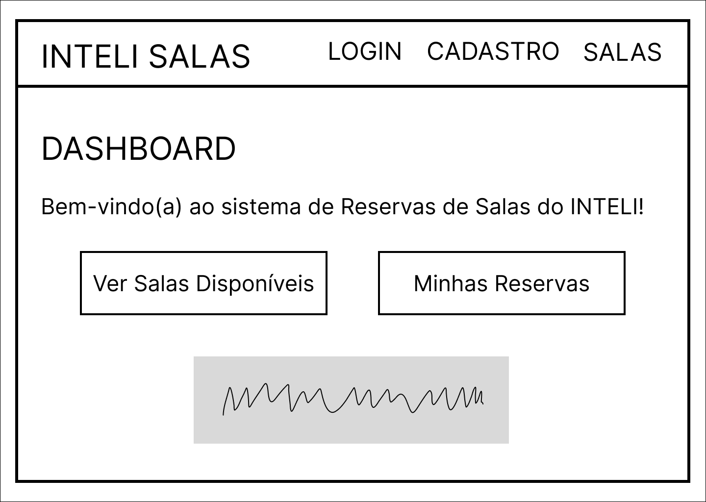
  
<sup>Fonte: Material produzido pelo autor (2025)
</div>
<br>

**Descrição:** A tela principal, ou Dashboard, é a primeira tela que o usuário visualiza após o login. Ela serve como um hub central, oferecendo acesso rápido às principais funcionalidades do sistema e exibindo informações relevantes.

**Elementos:**

*   **Barra de Navegação Superior:** Contém o logo do sistema ("INTELI SALAS") que serve como um botão de home e botões de navegação como "Salas" e "Minhas Reservas". Também pode incluir um ícone de perfil do usuário e um botão de logout (pode ser implementado). Além disso, existe as palavras "Login", "Cadastro" e "Salas" que são botões interativos que levam respectivamente para as telas que elas se remetem.
*   **Mensagem de Boas-Vindas:** Uma saudação personalizada ao usuário.
*   **Botões de Ação Rápida:**
    *   **"Ver Salas Disponíveis":** Leva o usuário para a tela de busca e reserva de salas.
    *   **"Minhas Reservas":** Leva o usuário para uma tela onde ele pode visualizar e gerenciar suas reservas existentes e reservas já feitas anteriormente.
*   **Seção de Notificações/Avisos:** Uma área para exibir informações importantes, como manutenções programadas, novas funcionalidades ou lembretes de reservas. (Pode ser implementado algum dia)
*   **Rodapé:** Pode conter informações de copyright e links para termos de serviço ou política de privacidade. (Se for necessário)

**Fluxo de Interação:**

1.  Após o login bem-sucedido, o usuário é direcionado para o Dashboard.
2.  O usuário pode visualizar informações gerais e ter acesso rápido às principais funcionalidades através dos botões de navegação.
3.  Clicar em "Ver Salas Disponíveis" redireciona para a tela de busca de salas.
4.  Clicar em "Minhas Reservas" redireciona para a tela de gerenciamento de reservas do usuário.
5.  A navegação principal no topo da página permite acesso a outras seções do sistema, das respectivas telas que as palavras se referem.

**User Stories Atendidas:**

*   Como usuário logado, quero ter uma visão geral das funcionalidades disponíveis no sistema.
*   Como usuário, quero poder navegar facilmente para as seções de busca de salas e gerenciamento das minhas reservas.

### 3.3.4 Tela de Busca de Salas (Exemplo de Funcionalidade Principal)

<div align="center">
<sub>Figura 06 - Tela de Busca de Salas
<br>
<br>
  
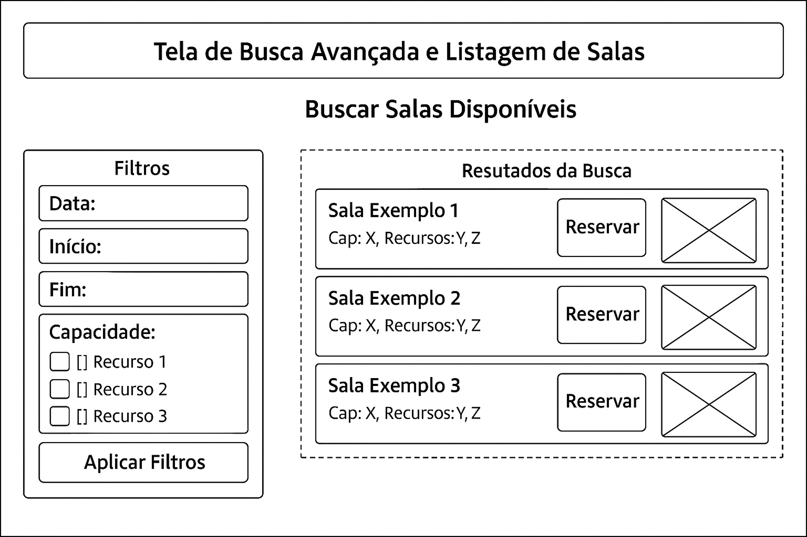
  
<sup>Fonte: Material produzido pelo autor (2025)
</div>
<br>

**Descrição:** Esta tela permite ao usuário buscar por salas disponíveis com base em critérios específicos, como data, horário, capacidade e recursos.

**Elementos Visuais Principais:**

*   **Filtros de Busca:**
    *   **Data:** Um campo para selecionar a data desejada para a reserva.
    *   **Horário de Início:** Um campo para selecionar o horário de início da reserva.
    *   **Horário de Fim:** Um campo para selecionar o horário de término da reserva.
    *   **Capacidade:** Um campo para especificar o número mínimo de pessoas que a sala deve comportar.
    *   **Recursos Adicionais:** Checkboxes ou um menu suspenso para selecionar recursos específicos (ex: lousa, tv).
*   **Botão de Busca:** Inicia a pesquisa com base nos filtros selecionados.
*   **Área de Resultados da Busca:** Exibe uma lista de salas que correspondem aos critérios de busca. Cada item da lista deve mostrar:
    *   Nome ou identificação da sala.
    *   Capacidade da sala.
    *   Recursos disponíveis na sala.
    *   Um botão ou link para "Reservar" a sala.

**Fluxo de Interação Típico:**

1.  O usuário acessa a tela de busca de salas (geralmente a partir do dashboard ou de um menu de navegação).
2.  O usuário preenche os campos de filtro de acordo com suas necessidades (data, horário, capacidade, recursos).
3.  O usuário clica no botão "Buscar Salas".
4.  O sistema processa a busca e exibe uma lista de salas disponíveis que atendem aos critérios.
5.  O usuário pode visualizar os detalhes de cada sala na lista (ex: fotos, descrição mais detalhada).
6.  O usuário seleciona uma sala e clica no botão "Reservar".
7.  O sistema pode levar o usuário para uma página de confirmação da reserva ou diretamente para uma tela de sucesso, dependendo do fluxo definido.

**Relação com as User Stories:**

Esta tela é crucial para múltiplas User Stories, como: "Como um usuário, quero poder buscar salas disponíveis especificando data, horário, capacidade e recursos necessários para encontrar a melhor opção para minha necessidade." e "Como um usuário, quero ver uma lista de salas disponíveis que correspondam aos meus critérios de busca, com informações claras sobre cada sala." O botão "Reservar" inicia a ação descrita em: "Como um usuário, quero poder reservar uma sala disponível diretamente a partir dos resultados da busca."

**Relação com a Persona (Cleber Alves):**

Esta tela é de importância vital para Cleber. Suas "Dores" incluem ter passado por conflitos de reserva e a falta de clareza sobre a disponibilidade de salas, além de sentir o processo atual como desorganizado. A "Tela de Busca Avançada e Listagem de Salas" ataca diretamente esses problemas ao:

*   **Oferecer Clareza na Disponibilidade:** Os filtros de data, horário, capacidade e recursos permitem que Cleber refine sua busca e veja apenas as salas que realmente atendem às suas necessidades e estão disponíveis, aliviando sua frustração com a incerteza.
*   **Agilizar o Processo de Agendamento:** A capacidade de buscar, ver detalhes e iniciar a reserva em uma única tela atende à sua "Motivação" de "agendar salas de forma rápida, centralizada e confiável".
*   **Prevenir Conflitos:** Ao mostrar apenas salas disponíveis e permitir a reserva direta, o sistema (suportado pelo backend) evita sobreposições, uma de suas principais "Dores".
*   **Atender Preferências de Uso:** A estrutura clara e objetiva da tela está alinhada com a preferência de Cleber por "sistemas simples, objetivos e acessíveis". Embora o wireframe seja desktop, a funcionalidade central é o que importa para ele.

Ao utilizar esta tela, Cleber pode otimizar sua rotina acadêmica, encontrando e reservando os espaços de que precisa sem o estresse e a informalidade do processo anterior.

### 3.3.5 Tela de Minhas Reservas

<div align="center">
<sub>Figura 07 - Tela de Minhas Reservas - Reservas Futuras
<br>
<br>
  
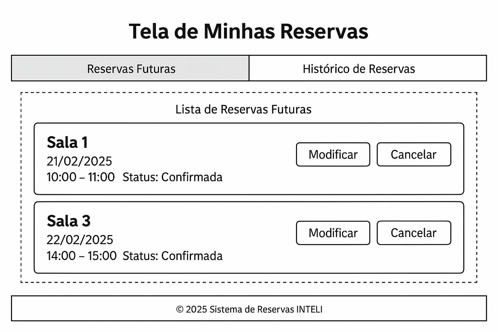
  
<sup>Fonte: Material produzido pelo autor (2025)
</div>
<br>

<div align="center">
<sub>Figura 08 - Tela de Minhas Reservas - Histórico de Reservas
<br>
<br>
  
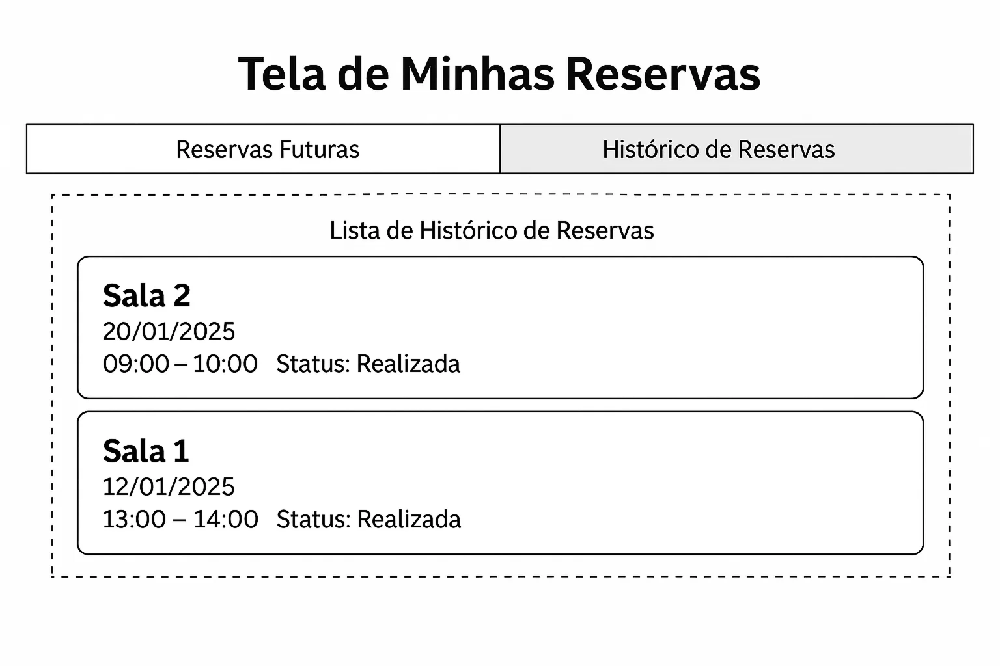
  
<sup>Fonte: Material produzido pelo autor (2025)
</div>
<br>

**Descrição:** A tela "Minhas Reservas" oferece ao usuário uma visão consolidada de todas as suas reservas de salas, separadas em duas abas principais: "Reservas Futuras" e "Histórico de Reservas". Isso permite um gerenciamento eficiente e um acompanhamento claro do uso das salas pelo usuário, proporcionando controle e organização sobre seus agendamentos.

**Elementos Comuns:**

*   **Título da Tela: "Tela de Minhas Reservas":** Identifica claramente a seção do sistema.
*   **Abas de Navegação:**
    *   **"Reservas Futuras":** Aba que, ao ser selecionada, exibe as reservas agendadas que ainda não ocorreram.
    *   **"Histórico de Reservas":** Aba que, ao ser selecionada, exibe as reservas que já foram concluídas ou canceladas.

**Elementos da Aba "Reservas Futuras":**

*   **Título da Lista: "Lista de Reservas Futuras"**: Indica o conteúdo exibido na aba.
*   **Itens de Reserva Futura:** Cada item na lista representa uma reserva agendada e exibe:
    *   **Nome da Sala (ex: "Sala 1"):** Identificação clara da sala reservada.
    *   **Data da Reserva (ex: "21/02/2025"):** Data para a qual a sala está reservada.
    *   **Horário da Reserva (ex: "10:00 – 11:00"):** Período específico da reserva.
    *   **Status da Reserva (ex: "Status: Confirmada"):** Indica o estado atual da reserva (ex: Confirmada, Pendente).
    *   **Botão "Modificar":** Permite ao usuário acessar a "Tela de Modificação de Reserva" para alterar os detalhes da reserva (ex: data, horário), sujeito às regras de modificação do sistema e disponibilidade.
    *   **Botão "Cancelar":** Permite ao usuário cancelar a reserva.

**Elementos da Aba "Histórico de Reservas":**

*   **Título da Lista: "Lista de Histórico de Reservas"**: Indica o conteúdo exibido na aba.
*   **Itens de Histórico de Reserva:** Cada item na lista representa uma reserva passada e exibe:
    *   **Nome da Sala (ex: "Sala 2"):** Identificação da sala que foi reservada.
    *   **Data da Reserva (ex: "20/01/2025"):** Data em que a reserva ocorreu.
    *   **Horário da Reserva (ex: "09:00 – 10:00"):** Período em que a sala esteve reservada.
    *   **Status da Reserva (ex: "Status: Realizada"):** Indica o estado final da reserva (ex: Realizada, Cancelada, Não Compareceu).

**Fluxo de Interação:**

1.  O usuário acessa a tela "Minhas Reservas", geralmente a partir do Dashboard (botão "Minhas Reservas") ou de um link de navegação.
2.  Por padrão, a aba "Reservas Futuras" é exibida, listando as próximas reservas do usuário.
3.  Na aba "Reservas Futuras", para cada reserva, o usuário pode:
    *   Clicar em "Modificar" para ser direcionado à "Tela de Modificação de Reserva" daquela reserva específica.
    *   Clicar em "Cancelar" para iniciar o processo de cancelamento da reserva (o sistema deve solicitar uma confirmação).
4.  O usuário pode clicar na aba "Histórico de Reservas".
5.  A lista é atualizada para exibir as reservas passadas, com seus respectivos detalhes e status finais. Não há ações de modificação ou cancelamento para reservas no histórico.

**Relação com as User Stories:**

Esta tela é fundamental para várias User Stories, incluindo:
*   "Como um usuário, quero poder visualizar todas as minhas reservas futuras em um só lugar, com detalhes como sala, data, horário e status."
*   "Como um usuário, quero poder modificar ou cancelar minhas reservas futuras quando necessário."
*   "Como um usuário, quero poder consultar o histórico das minhas reservas passadas para acompanhar meu uso das salas."
*   "Como um usuário, quero poder modificar os detalhes de uma reserva futura, como data ou horário, se necessário."
*   "Como um usuário, quero poder cancelar uma reserva futura se meus planos mudarem."
*   "Como um usuário, quero poder visualizar meu histórico de reservas passadas para referência."

**Relação com a Persona (Cleber Alves):**

A tela "Minhas Reservas" é essencial para Cleber, pois aborda diretamente várias de suas necessidades e dores:

*   **Organização e Controle:** Cleber "usa Notion, Google Calendar e Discord para se organizar". Ter uma visão centralizada de suas "Reservas Futuras" e "Histórico de Reservas" em um único local, com status claros, permite que ele mantenha o controle sobre seus agendamentos de salas, alinhando-se com seus hábitos digitais e necessidade de organização. A clareza das informações de data, hora e status da sala é crucial para ele.
*   **Agilidade e Autonomia:** A possibilidade de "Modificar" ou "Cancelar" uma reserva futura diretamente pela tela confere a Cleber a autonomia e rapidez que ele valoriza em sistemas ("prefere sistemas simples, objetivos e acessíveis"). Isso evita processos burocráticos ou informais que ele percebe como uma "Dor" no sistema atual, que é "desorganizado e informal".
*   **Clareza e Confiança:** A visualização clara do status ("Confirmada", "Realizada") e dos detalhes de cada reserva contribui para a "confiança" que ele busca ao "agendar salas de forma rápida, centralizada e confiável". Isso mitiga a "falta de clareza sobre a disponibilidade de salas" e a sensação de um processo desorganizado.
*   **Otimização da Rotina:** Ao gerenciar suas reservas de forma eficiente, Cleber pode "otimizar sua rotina acadêmica", um dos benefícios que a "Solução" proposta visa entregar a ele. Ter um histórico também o ajuda a lembrar de salas que ele gostou de usar ou padrões de uso.

Esta funcionalidade, portanto, não apenas atende aos requisitos funcionais, mas também melhora significativamente a experiência de Cleber, tornando o gerenciamento de suas reservas de sala uma tarefa simples, confiável e alinhada com suas expectativas de um sistema eficiente.

### 3.3.6 Tela de Modificação de Reserva

<div align="center">
<sub>Figura 08 - Tela de Minhas Reservas - Histórico de Reservas
<br>
<br>
  
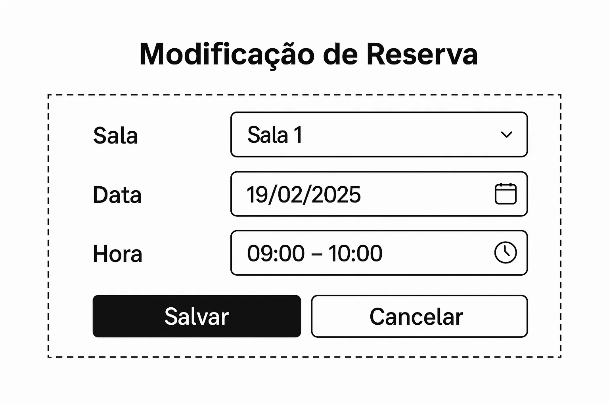
  
<sup>Fonte: Material produzido pelo autor (2025)
</div>
<br>

**Descrição:** A tela de Modificação de Reserva permite ao usuário alterar os detalhes de uma reserva existente que ainda não ocorreu. O objetivo é oferecer flexibilidade, permitindo ajustes na reserva (como data, horário ou, potencialmente, a sala) conforme a necessidade do usuário, sempre sujeito às políticas do sistema e à disponibilidade da sala no novo horário/data desejado.

**Elementos:**

*   **Título da Tela: "Modificação de Reserva":** Indica claramente a finalidade da tela.
*   **Campo "Sala":** Exibe o nome da sala atualmente reservada (ex: "Sala 1"). O wireframe apresenta este campo com uma seta para baixo, sugerindo que pode ser um seletor (dropdown). Se for um seletor, permitiria ao usuário tentar trocar de sala, o que exigiria uma nova verificação de disponibilidade para a nova sala no horário desejado. Caso contrário, se a troca de sala não for permitida nesta tela, seria um campo de texto não editável exibindo a sala original.
*   **Campo "Data":** Um campo de entrada, pré-preenchido com a data atual da reserva (ex: "19/02/2025"). Possui um ícone de calendário, indicando que um seletor de data (datepicker) está disponível para o usuário escolher uma nova data para a reserva.
*   **Campo "Hora":** Um campo de entrada, pré-preenchido com o horário atual da reserva (ex: "09:00 – 10:00"). Possui um ícone de relógio, indicando que um seletor de horário (timepicker) está disponível para o usuário escolher um novo período (início e fim) para a reserva.
*   **Botão "Salvar":** Um botão de ação primário. Ao ser clicado, submete as alterações propostas para validação. O sistema verificará a disponibilidade da sala (a mesma ou uma nova, dependendo da implementação do campo "Sala") para a nova data/horário. Se disponível e as alterações forem válidas conforme as regras de negócio (ex: antecedência mínima para modificação), a reserva é atualizada.
*   **Botão "Cancelar":** Um botão de ação secundário. Ao ser clicado, descarta quaisquer alterações feitas nos campos e retorna o usuário à tela anterior (provavelmente a tela "Minhas Reservas - Futuras"), sem salvar as modificações.

**Fluxo de Interação:**

1.  O usuário chega a esta tela após clicar no botão "Modificar" de uma reserva específica na tela "Minhas Reservas - Futuras".
2.  Os campos ("Sala", "Data", "Hora") são pré-preenchidos com os detalhes da reserva atual.
3.  O usuário pode interagir com os campos para propor alterações:
    *   **Sala:** Se for um seletor, o usuário pode tentar selecionar uma nova sala.
    *   **Data:** O usuário clica no campo ou no ícone de calendário para abrir um seletor e escolher uma nova data.
    *   **Hora:** O usuário clica no campo ou no ícone de relógio para abrir um seletor e escolher um novo horário de início e fim.
4.  Após fazer as modificações desejadas, o usuário clica no botão "Salvar".
5.  O sistema realiza as seguintes validações:
    *   Verifica a disponibilidade da sala (original ou nova) para a nova data e horário.
    *   Verifica se a modificação respeita as regras de negócio (ex: antecedência mínima, duração máxima/mínima da reserva).
6.  **Cenário de Sucesso:** Se a modificação for possível e todas as validações passarem, a reserva é atualizada no sistema. O usuário é notificado do sucesso (por exemplo, com uma mensagem de confirmação) e é redirecionado de volta para a tela "Minhas Reservas", onde a reserva aparecerá com os detalhes atualizados.
7.  **Cenário de Falha:** Se a modificação não for possível (ex: sala indisponível no novo horário, violação de regra de negócio), uma mensagem de erro clara é exibida na tela, explicando o motivo. O usuário permanece na tela de modificação, com os valores alterados ainda presentes, para que possa tentar outros horários/datas ou cancelar a alteração.
8.  Se o usuário clicar no botão "Cancelar" a qualquer momento, nenhuma alteração é salva, e ele é retornado à tela "Minhas Reservas - Futuras".

**Relação com as User Stories:**

Esta tela atende diretamente à User Story: "Como um usuário, quero poder modificar os detalhes de uma reserva futura, como sala, data ou horário, se houver disponibilidade e conforme as políticas do sistema." A validação de disponibilidade e o respeito às políticas do sistema são aspectos cruciais implícitos nesta história e refletidos no fluxo de interação.

**Relação com a Persona (Cleber Alves):**

A tela de "Modificação de Reserva" é particularmente relevante para Cleber, pois oferece a flexibilidade e o controle que ele valoriza e que suprem suas dores atuais:

*   **Adaptação à Rotina Dinâmica:** A vida de um estudante como Cleber pode ser imprevisível, com mudanças de horários de aulas ou compromissos. A necessidade de alterar uma reserva de sala (data, hora ou até mesmo a sala, se o sistema permitir e houver disponibilidade) é uma realidade. Esta tela permite que ele faça esses ajustes de forma autônoma, o que se alinha com sua preferência por "sistemas simples, objetivos e acessíveis" e sua necessidade de "otimizar sua rotina acadêmica".
*   **Redução de Estresse e Burocracia:** Em um sistema "desorganizado e informal" (uma de suas "Dores" com o processo atual), modificar uma reserva poderia ser um processo complicado, demorado e sujeito a falhas. A tela de modificação oferece uma maneira "rápida, centralizada e confiável" de gerenciar mudanças, o que é uma de suas "Motivações" e parte da "Solução" que o sistema visa oferecer.
*   **Autonomia e Confiança:** Poder modificar seus próprios agendamentos, com feedback imediato sobre a disponibilidade (implícito no fluxo de salvar e validar), aumenta a confiança de Cleber no sistema e em sua capacidade de gerenciar seus compromissos sem depender de intermediários ou processos manuais.
*   **Prevenção de Problemas e Conflitos:** Ao permitir que Cleber ajuste suas reservas de forma proativa, o sistema ajuda a evitar que salas fiquem reservadas e não utilizadas, ou que ele precise cancelar e refazer todo o processo por uma pequena alteração, o que poderia levar a novos "conflitos de reserva" ou perda de tempo. Isso contribui para evitar as "Dores" que ele já vivenciou.

Para Cleber, que "ama usar as salas de reunião" e busca eficiência, a capacidade de modificar uma reserva de forma descomplicada e transparente é um diferencial importante, tornando o sistema mais útil, adaptado às suas necessidades reais como estudante do INTELI e reforçando a percepção de um sistema estruturado e confiável.

### 3.4. Guia de estilos

Este guia de estilos documenta os padrões visuais e de interface implementados no Sistema de Reservas de Salas do INTELI. O objetivo é garantir a consistência visual, a usabilidade e o alinhamento com a identidade da marca INTELI em todas as telas e interações da aplicação. As diretrizes aqui apresentadas foram completamente implementadas no arquivo `/public/css/inteli-theme.css` e devem ser seguidas para futuras implementações e manutenções no sistema, assegurando uma experiência de usuário coesa e profissional.

O sistema implementa fielmente o Design System oficial do INTELI através de variáveis CSS organizadas e componentes padronizados, garantindo total consistência visual em toda a aplicação.

**Layout Geral**

O layout da aplicação foi estruturado para oferecer clareza e facilidade de navegação, seguindo rigorosamente os princípios do Design System INTELI. Adota-se um design limpo, com amplo uso de espaço em branco para separar visualmente os elementos e melhorar a legibilidade. O conteúdo principal é centralizado ou contido dentro de seções bem definidas, utilizando cards com cantos arredondados (`border-radius: 1rem`) e sombras sutis (`box-shadow: 0 1px 2px rgba(0,0,0,0.05)`) para agrupar informações relacionadas.

As margens e espaçamentos seguem um sistema consistente baseado em variáveis CSS:
- `--spacing-xs: 0.25rem` (4px)
- `--spacing-sm: 0.5rem` (8px)
- `--spacing-md: 1rem` (16px)
- `--spacing-lg: 1.5rem` (24px)
- `--spacing-xl: 2rem` (32px)

O cabeçalho possui posição sticky com fundo roxo INTELI e padrão sutil de pontos conforme manual da marca (`background-image: radial-gradient(circle, rgba(255,255,255,0.1) 1px, transparent 1px)`). A estrutura é completamente responsiva, adaptando-se a diferentes dispositivos através de breakpoints bem definidos.

**Tipografia**

A tipografia implementada segue exatamente as diretrizes do Manual da Marca INTELI, utilizando as fontes oficiais importadas via Google Fonts:

1.  **Space Mono Bold (`--font-secondary`):** Implementada para títulos principais (H1-H6), chamadas de destaque e elementos que necessitam de maior ênfase visual. Aplicada através da classe `.inteli-title` e automaticamente em todos os headings. Sua natureza monoespaçada e peso bold (700) conferem caráter moderno e tecnológico, perfeitamente alinhado à identidade do INTELI.

2.  **Manrope Normal (`--font-primary`):** Implementada para todo o texto corrido, descrições, labels de formulários, itens de menu, texto de botões e informações complementares através da classe `.inteli-text`. Disponível em múltiplos pesos (200-800) garantindo flexibilidade tipográfica e excelente legibilidade.

**Sistema de Tamanhos Implementado:**
- `--font-size-xs: 0.75rem` (12px)
- `--font-size-sm: 0.875rem` (14px)
- `--font-size-base: 1rem` (16px)
- `--font-size-lg: 1.125rem` (18px)
- `--font-size-xl: 1.25rem` (20px)
- `--font-size-2xl: 1.5rem` (24px)
- `--font-size-3xl: 1.875rem` (30px)
- `--font-size-4xl: 2.25rem` (36px)

A hierarquia visual é estabelecida através de tamanhos progressivos, com títulos principais utilizando Space Mono Bold em tamanhos maiores e textos descritivos em Manrope Normal com tamanhos apropriados para cada contexto.

**Cores**

A paleta de cores implementada segue rigorosamente o Manual da Marca INTELI, sendo definida através de variáveis CSS organizadas no arquivo `inteli-theme.css`. Todas as cores são aplicadas consistentemente em toda a aplicação, garantindo identidade visual marcante e funcionalidade adequada.

**Cores Primárias INTELI (Implementadas):**
- **Roxo INTELI (`--inteli-roxo: #2e2640`):** Implementado como cor principal em fundos de cabeçalho (`.inteli-header`), rodapés, cards de destaque (`.inteli-card-primary`) e elementos de navegação. Confere sobriedade e identidade visual marcante em toda a aplicação.
- **Coral INTELI (`--inteli-coral: #ff4545`):** Implementado como cor de destaque principal em botões primários (`.btn-inteli-primary`), links ativos, call-to-actions e elementos de ação como "Reservar Agora", "Confirmar Reserva" e "Entrar".
- **Lilás INTELI (`--inteli-lilas: #855ede`):** Implementado em ícones de apoio, elementos gráficos decorativos, cards de funcionalidades (`.inteli-card-graphic`) e destaques visuais secundários.
- **Azul INTELI (`--inteli-azul: #1426ab`):** Implementado em botões alternativos, cabeçalhos de cards (`.inteli-card-header`), links secundários e elementos de navegação interna, oferecendo contraste profissional.
- **Cinza INTELI (`--inteli-cinza: #cccfd1`):** Implementado para bordas sutis, divisores, fundos de elementos secundários e estados desabilitados de componentes.

**Cores Secundárias INTELI (Implementadas):**
- **Laranja INTELI (`--inteli-laranja: #ff8245`):** Implementado para alertas de aviso (`.inteli-alert-warning`), notificações secundárias e elementos de destaque moderado.
- **Cinza Escuro INTELI (`--inteli-cinza-escuro: #878a96`):** Implementado para texto secundário, descrições, placeholders de formulários e informações complementares, garantindo hierarquia visual clara.
- **Violeta INTELI (`--inteli-violeta: #4a17ab`):** Implementado em elementos gráficos auxiliares, fundos de apoio e componentes decorativos específicos.
- **Azul Royal INTELI (`--inteli-azul-royal: #124aed`):** Implementado em ícones destacados, elementos gráficos especiais e componentes de interface específicos.

**Cores Neutras (Implementadas):**
- **Branco (`--inteli-branco: #FFFFFF`):** Implementado extensivamente como fundo principal de cards, modais, formulários e texto sobre fundos escuros, garantindo contraste e legibilidade ótimos.
- **Preto (`--inteli-preto: #000000`):** Implementado para texto principal sobre fundos claros, garantindo máximo contraste e legibilidade.

**Cores Funcionais/Status (Implementadas):**
- **Verde (`--inteli-verde: #28a745`):** Implementado para status positivos como "Disponível", "Confirmada", alertas de sucesso (`.inteli-alert-success`) e feedback positivo.
- **Vermelho (`--inteli-vermelho: #dc3545`):** Implementado para status negativos como "Ocupada", botões destrutivos como "Cancelar", alertas de erro (`.inteli-alert-danger`) e validações de formulário.
- **Azul Claro (`--inteli-azul-claro: #e3f2fd`):** Implementado como fundo para caixas informativas (`.inteli-alert-info`), dicas de uso e seções de ajuda.

**Botões**

Os botões implementados no sistema seguem um padrão visual rigoroso e hierárquico, com todos os estados visuais completamente definidos através de classes CSS específicas:

**Botões Primários (`.btn-inteli-primary`):**
- **Aparência:** Fundo sólido Coral INTELI (`--inteli-coral: #ff4545`), texto branco Manrope (peso 500), cantos arredondados (`border-radius: 0.5rem`), sombra sutil (`box-shadow: 0 1px 2px rgba(0,0,0,0.05)`)
- **Funcionalidade:** Utilizados para ações principais como "Reservar Agora", "Entrar", "Confirmar Reserva", "Salvar"
- **Estados Implementados:**
  - **Normal:** Fundo coral, texto branco
  - **Hover:** Fundo muda para azul INTELI (`--inteli-azul`), elevação visual (`transform: translateY(-2px)`)
  - **Active:** Retorna à posição original (`transform: translateY(0)`)
  - **Disabled:** Fundo cinza (`--inteli-cinza`), texto cinza escuro, cursor `not-allowed`

**Botões Secundários (`.btn-inteli-secondary`):**
- **Aparência:** Fundo branco, borda sólida coral (2px), texto coral, cantos arredondados, display flex com ícones
- **Funcionalidade:** Utilizados para ações alternativas como "Cancelar", "Ver Detalhes", "Voltar"
- **Estados Implementados:**
  - **Normal:** Fundo branco, borda e texto coral
  - **Hover:** Fundo coral, texto branco, elevação visual
  - **Active:** Retorna à posição original
  - **Disabled:** Borda e texto cinza, sem interatividade

**Botões Terciários/Links (`.btn-inteli-link`):**
- **Aparência:** Texto simples em azul INTELI ou lilás INTELI, sem fundo ou borda
- **Funcionalidade:** Navegação secundária, "Esqueci minha senha", links auxiliares
- **Estados Implementados:**
  - **Normal:** Texto colorido sem decoração
  - **Hover:** Sublinhado automático, mudança de cor
  - **Active:** Feedback visual sutil

**Botões Destrutivos (`.btn-inteli-danger`):**
- **Aparência:** Fundo vermelho funcional (`--inteli-vermelho`), texto branco
- **Funcionalidade:** Ações destrutivas como "Cancelar Reserva", "Excluir"
- **Estados:** Todos os estados visuais implementados com cores apropriadas

**Características Técnicas Implementadas:**
- **Transições:** `transition: all 0.3s ease` em todos os botões
- **Flexbox:** `display: inline-flex` com `align-items: center` e `gap: 0.5rem` para ícones
- **Acessibilidade:** Contraste adequado, estados de foco visíveis
- **Responsividade:** Adaptação automática em dispositivos móveis

**Assets**

Os assets visuais implementados complementam perfeitamente a interface e reforçam a identidade da marca INTELI de forma consistente:

**Logotipo INTELI:**
- **Implementação:** Logo oficial INTELI (branca e vermelha) aplicada consistentemente através da classe `.logo-img` com `height: 50px` padronizado
- **Localização:** Presente no cabeçalho principal (`.inteli-header`) de todas as páginas, telas de autenticação e rodapé
- **Comportamento:** Efeito hover com `transform: scale(1.1)` e transição suave (`transition: all 0.3s ease`)
- **Acessibilidade:** Alt text apropriado e link para página inicial

**Sistema de Ícones:**
- **Biblioteca:** Font Awesome 6 completamente implementada para ícones limpos e modernos
- **Ícones Principais Implementados:**
  - `fas fa-user` - Perfil e autenticação
  - `fas fa-door-open` - Salas e acesso
  - `fas fa-calendar-check` - Reservas e agendamentos
  - `fas fa-clock` - Horários e tempo
  - `fas fa-map-marker-alt` - Localização
  - `fas fa-tv`, `fas fa-chalkboard` - Recursos de sala
  - `fas fa-eye`, `fas fa-edit`, `fas fa-trash` - Ações de interface
  - `fas fa-graduation-cap` - Identidade acadêmica
- **Estilização:** Ícones coloridos com cores INTELI (coral, lilás, azul royal) em cards funcionais
- **Responsividade:** Tamanhos adaptativos conforme contexto

**Grafismos e Padrões:**
- **Padrão de Pontos:** Implementado via CSS no cabeçalho (`background-image: radial-gradient(circle, rgba(255,255,255,0.1) 1px, transparent 1px)`)
- **Aplicação:** Sobre fundos roxo INTELI conforme manual da marca
- **Funcionalidade:** Adiciona textura visual sutil sem comprometer legibilidade
- **Responsividade:** `background-size: 20px 20px` para consistência visual

**Cards e Componentes Visuais:**
- **Cards Implementados:** `.inteli-card` com variações (primary, action, graphic)
- **Sombras:** Sistema de sombras progressivas (`--shadow-sm` a `--shadow-xl`)
- **Bordas:** Cantos arredondados consistentes (`--radius-md: 0.5rem` a `--radius-xl: 1rem`)
- **Hover Effects:** Elevação visual (`transform: translateY(-4px)`) e mudança de sombra

**Sistema de Espaçamentos:**
- **Implementação:** Variáveis CSS para espaçamentos consistentes
- **Aplicação:** Margens, paddings e gaps padronizados em toda a interface
- **Responsividade:** Adaptação automática em breakpoints móveis

**Componentes de Status:**
- **Alertas:** `.inteli-alert-success`, `.inteli-alert-danger`, `.inteli-alert-warning`, `.inteli-alert-info`
- **Badges:** Status de salas (disponível/ocupada) com cores funcionais
- **Indicadores:** Feedback visual para estados de reserva

Este guia implementado fornece a base sólida e completamente funcional para a interface do Sistema de Reservas de Salas INTELI, garantindo uma experiência de usuário consistente, profissional e totalmente alinhada à identidade visual da instituição através de código CSS organizado e reutilizável.


### 3.5. Protótipo de alta fidelidade

A seguir é apresentado as telas que compõem o protótipo de alta fidelidade do Sistema de Reservas de Salas do INTELI. Este protótipo reflete visualmente as funcionalidades e fluxos de interação definidos nas etapas anteriores do projeto, aplicando os padrões visuais estabelecidos no Guia de Estilos (seção 3.4) e alinhando-se à identidade visual do INTELI. As imagens estão organizadas para demonstrar os principais fluxos de navegação do usuário, desde o acesso inicial até a gestão de reservas e perfil.

**Fluxo Principal e Telas:**

1.  **Tela de Login:** Ponto de entrada para usuários existentes acessarem o sistema.

<div align="center">
<sub>Figura 10 - Tela de Login
<br>
<br>
  
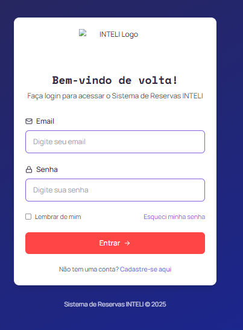
  
<sup>Fonte: Material produzido pelo autor (2025)
</div>
<br>

2.  **Tela de Cadastro:** Permite que novos usuários criem uma conta no sistema.

<div align="center">
<sub>Figura 11 - Tela Cadastro
<br>
<br>
  
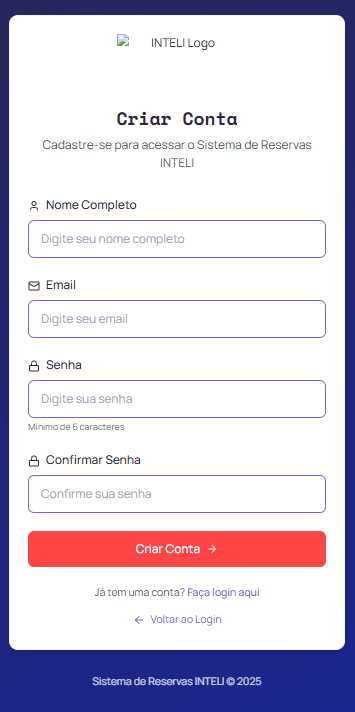
  
<sup>Fonte: Material produzido pelo autor (2025)
</div>
<br>

3.  **Tela Principal (Parte 1 - Boas-vindas):** Primeira visualização após o login, apresentando o sistema e um acesso rápido à reserva.

<div align="center">
<sub>Figura 12 - Tela Principal 1
<br>
<br>
  

  
<sup>Fonte: Material produzido pelo autor (2025)
</div>
<br>

4.  **Tela Principal (Parte 2 - Funcionalidades):** Continuação da tela principal, destacando as principais funcionalidades: Consultar Salas, Ver Minhas Reservas e Ver Meu Perfil.

<div align="center">
<sub>Figura 13 - Tela Principal 2
<br>
<br>
  
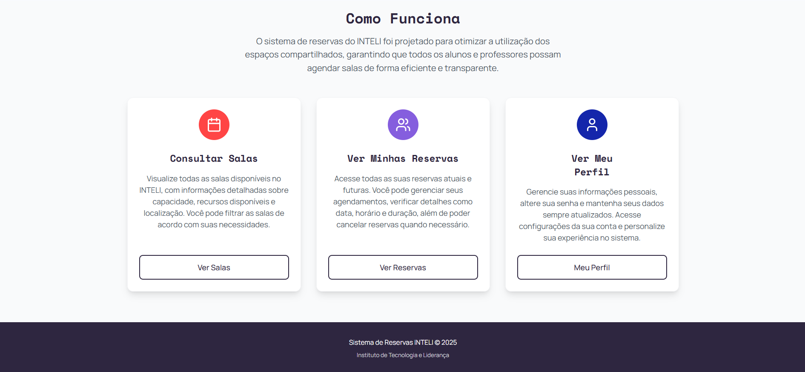
  
<sup>Fonte: Material produzido pelo autor (2025)
</div>
<br>

5.  **Tela de Salas Disponíveis:** Lista as salas disponíveis para reserva, com informações resumidas e opções de visualização de detalhes ou reserva direta.

<div align="center">
<sub>Figura 14 - Tela de Salas Disponíveis 
<br>
<br>
  
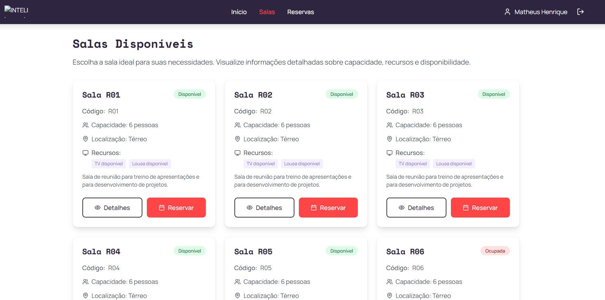
  
<sup>Fonte: Material produzido pelo autor (2025)
</div>
<br>

6.  **Tela de Detalhes da Sala:** Exibe informações completas sobre uma sala específica, incluindo capacidade, recursos, descrição e disponibilidade.

<div align="center">
<sub>Figura 15 - Tela de Detalhes da Sala
<br>
<br>
  
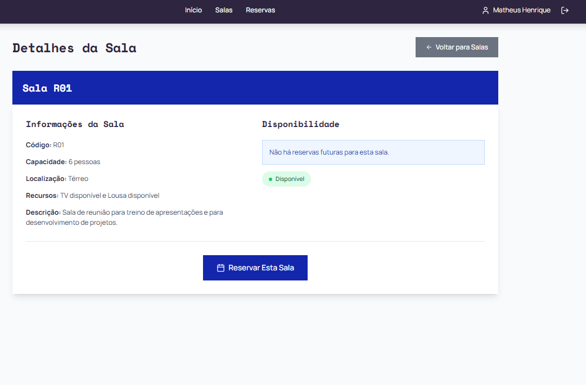
  
<sup>Fonte: Material produzido pelo autor (2025)
</div>
<br>

7.  **Tela de Reserva de Sala:** Formulário para o usuário realizar o agendamento de uma sala, especificando data, horário, finalidade e número de participantes.

<div align="center">
<sub>Figura 16 - Tela de Reserva de Sala
<br>
<br>
  
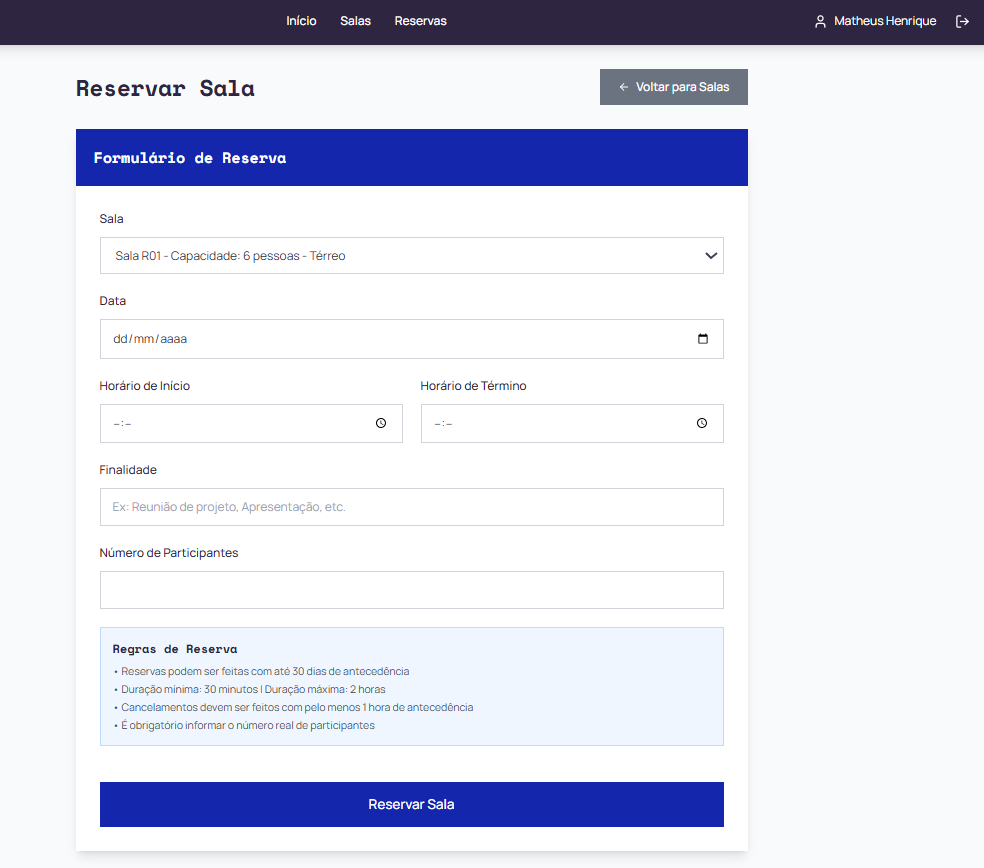
  
<sup>Fonte: Material produzido pelo autor (2025)
</div>
<br>

8.  **Tela de Minhas Reservas:** Permite ao usuário visualizar suas reservas ativas e o histórico de reservas passadas, com opções para ver detalhes ou cancelar agendamentos.

<div align="center">
<sub>Figura 17 - Tela de Minhas Reservas
<br>
<br>
  
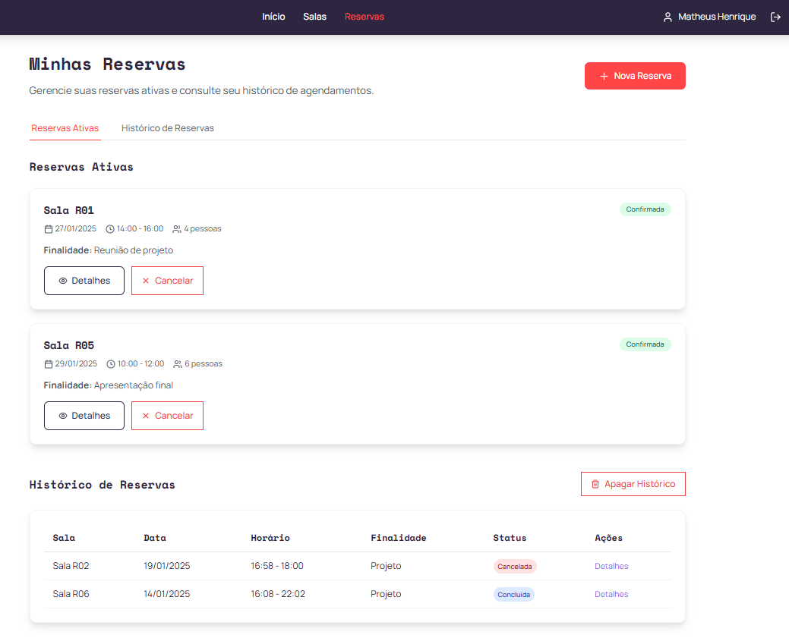
  
<sup>Fonte: Material produzido pelo autor (2025)
</div>
<br>

9.  **Tela de Detalhes da Reserva:** Apresenta todas as informações de uma reserva específica, tanto da reserva em si quanto da sala reservada.

<div align="center">
<sub>Figura 18 - Tela de Detalhes de Reserva
<br>
<br>
  
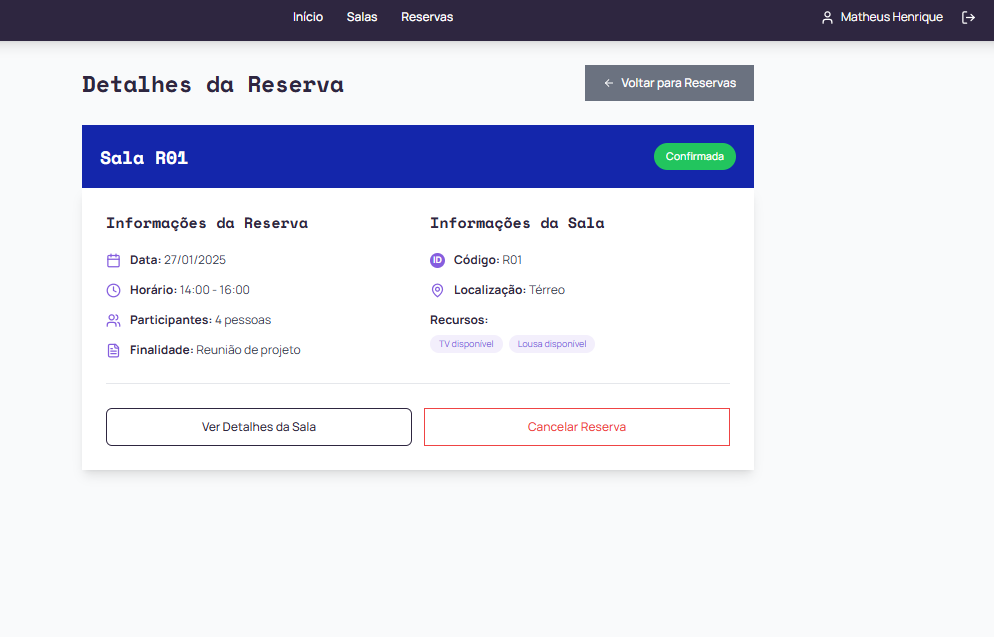
  
<sup>Fonte: Material produzido pelo autor (2025)
</div>
<br>

10. **Tela de Perfil:** Área onde o usuário pode visualizar e atualizar suas informações pessoais e alterar sua senha.

<div align="center">
<sub>Figura 19 - Tela de Perfil
<br>
<br>
  
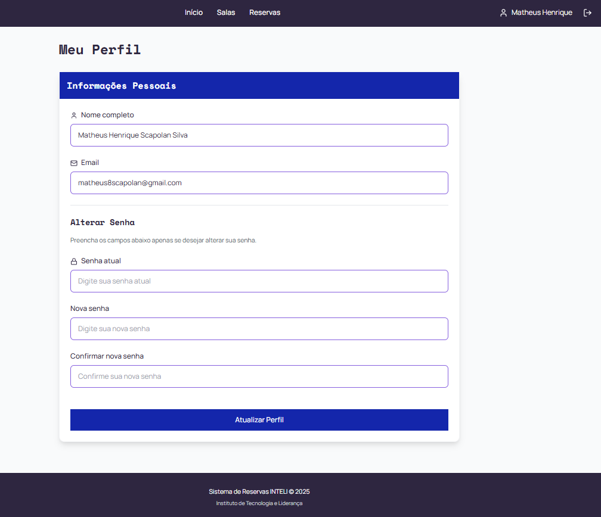
  
<sup>Fonte: Material produzido pelo autor (2025)
</div>
<br>

11. **Tela de Logout:** Confirmação visual de que o usuário está sendo desconectado do sistema.

<div align="center">
<sub>Figura 20 - Tela de Logout
<br>
<br>
  
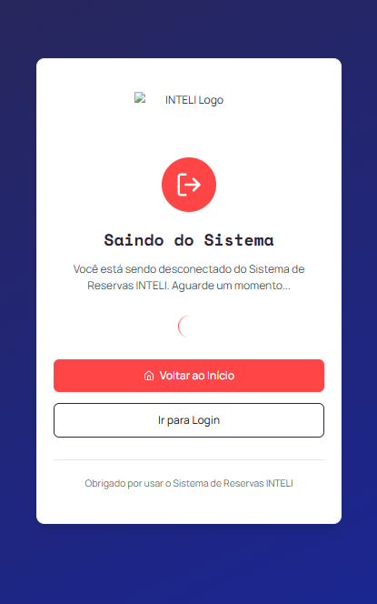
  
<sup>Fonte: Material produzido pelo autor (2025)
</div>
<br>

Este conjunto de telas representa a interface visual final proposta para o sistema, servindo como guia para o desenvolvimento front-end e garantindo uma experiência de usuário consistente e alinhada aos objetivos do projeto e à identidade do INTELI.

### 3.6. WebAPI e endpoints

## 3.6.1 Arquitetura Implementada:

O Sistema de Reservas INTELI implementa uma arquitetura RESTful robusta baseada no padrão Model-View-Controller (MVC), utilizando Node.js com Express.js como framework principal. A API foi desenvolvida seguindo os princípios REST, com separação clara entre rotas de API (`/api/*`) e rotas web (`/*`), garantindo flexibilidade para diferentes tipos de clientes.

**Estrutura de Rotas Implementada:**

A aplicação organiza suas rotas em dois grupos principais:
- **Rotas Web** (`routes/webRoutes.js`): Renderizam páginas EJS para interface do usuário
- **Rotas API** (`routes/index.js`): Fornecem endpoints RESTful para comunicação programática

**Organização Modular:**
- `routes/authRoutes.js`: Endpoints de autenticação JWT
- `routes/roomRoutes.js`: Gerenciamento de salas
- `routes/bookingRoutes.js`: Sistema de reservas
- `routes/bookingHistoryRoutes.js`: Histórico de reservas
- `routes/userRoutes.js`: Gerenciamento de usuários

**Middlewares de Segurança:**
- **Autenticação JWT**: Middleware `authenticate` para proteção de rotas
- **Autorização**: Middleware `isAdmin` para operações administrativas
- **Validação**: Validação de dados de entrada em todos os endpoints

<div align="center">
<sub>Figura 10 - Diagrama de Arquitetura MVC - Sistema de Reserva de Salas INTELI
<br>
<br>
  
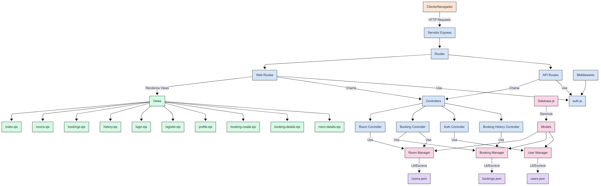
  
<sup>Fonte: Material produzido pelo autor (2025)
</div>
<br>

**Código Usado no Mermaid:** 

```text
graph TD
    %% Definição dos estilos
    classDef model fill:#f9d5e5,stroke:#333,stroke-width:1px
    classDef view fill:#d5f9e5,stroke:#333,stroke-width:1px
    classDef controller fill:#d5e5f9,stroke:#333,stroke-width:1px
    classDef database fill:#e5d5f9,stroke:#333,stroke-width:1px
    classDef client fill:#f9e5d5,stroke:#333,stroke-width:1px

    %% Cliente/Usuário
    Client[Cliente/Navegador] --> |HTTP Requests| Server
    
    %% Servidor Express
    Server[Servidor Express] --> Routes
    
    %% Rotas
    Routes --> WebRoutes[Web Routes]
    Routes --> ApiRoutes[API Routes]
    
    %% Rotas Web
    WebRoutes --> |Renderiza Views| Views
    WebRoutes --> |Chama| Controllers
    
    %% Rotas API
    ApiRoutes --> |Chama| Controllers
    
    %% Controllers
    Controllers --> RoomController[Room Controller]
    Controllers --> BookingController[Booking Controller]
    Controllers --> AuthController[Auth Controller]
    Controllers --> BookingHistoryController[Booking History Controller]
    
    %% Models
    Database[Database.js] --> |Gerencia| Models
    Models --> RoomManager[Room Manager]
    Models --> BookingManager[Booking Manager]
    Models --> UserManager[User Manager]
    
    %% Interação Controllers-Models
    RoomController --> |Usa| RoomManager
    BookingController --> |Usa| BookingManager
    BookingController --> |Usa| RoomManager
    AuthController --> |Usa| UserManager
    BookingHistoryController --> |Usa| BookingManager
    
    %% Persistência de Dados
    RoomManager --> |Lê/Escreve| RoomsJSON[rooms.json]
    BookingManager --> |Lê/Escreve| BookingsJSON[bookings.json]
    UserManager --> |Lê/Escreve| UsersJSON[users.json]
    
    %% Views
    Views --> IndexView[index.ejs]
    Views --> RoomsView[rooms.ejs]
    Views --> BookingsView[bookings.ejs]
    Views --> HistoryView[history.ejs]
    Views --> LoginView[login.ejs]
    Views --> RegisterView[register.ejs]
    Views --> ProfileView[profile.ejs]
    Views --> BookingCreateView[booking-create.ejs]
    Views --> BookingDetailsView[booking-details.ejs]
    Views --> RoomDetailsView[room-details.ejs]
    
    %% Middlewares
    Middlewares[Middlewares] --> AuthMiddleware[auth.js]
    WebRoutes --> |Usa| AuthMiddleware
    ApiRoutes --> |Usa| AuthMiddleware

    %% Aplicar estilos
    class Client client
    class Server,Routes,WebRoutes,ApiRoutes controller
    class Controllers,RoomController,BookingController,AuthController,BookingHistoryController controller
    class Database,Models,RoomManager,BookingManager,UserManager model
    class RoomsJSON,BookingsJSON,UsersJSON database
    class Views,IndexView,RoomsView,BookingsView,HistoryView,LoginView,RegisterView,ProfileView,BookingCreateView,BookingDetailsView,RoomDetailsView view
    class Middlewares,AuthMiddleware controller
```

---

**Contextualização da Arquitetura MVC no Projeto**

A arquitetura MVC é um padrão de design amplamente utilizado no desenvolvimento de aplicações web. Sua estrutura divide a aplicação em três componentes principais interconectados: Model (Modelo), View (Visão) e Controller (Controlador). 

No contexto do sistema de Reserva de Salas, essa separação é particularmente uma ótima opção. O **Model** é responsável pela representação dos dados e pela lógica de negócios associada a eles, interagindo diretamente com o banco de dados PostgreSQL no Supabase. Ele encapsula as regras de manipulação de dados para entidades como Usuários, Salas e Reservas.

A **View**, implementada com EJS (Embedded JavaScript templates), é responsável pela apresentação dos dados ao usuário e pela interface com a qual ele interage. Ela recebe os dados processados pelo Controller e os renderiza de forma compreensível no navegador do cliente.

O **Controller**, por sua vez, atua como intermediário entre o Model e a View. Ele recebe as requisições do usuário (originadas nas Views), processa essas requisições invocando a lógica apropriada nos Models, e seleciona a View adequada para apresentar a resposta ao usuário. 

Essa estrutura modular permite que alterações em um componente tenham impacto mínimo nos outros, promovendo um desenvolvimento mais ágil e organizado.

---

**Desenvolvimento e Fluxo de Interação**

O fluxo de interação no sistema de Reserva de Salas, conforme representado no diagrama abaixo, inicia-se com a ação do usuário no **Cliente** (navegador web). Uma requisição HTTP é enviada ao **Servidor** (Node.js com Express). O roteador do Express direciona a requisição para o **Controller** apropriado (ex: `BookingController` para uma nova reserva).

O Controller interpreta a requisição, valida os dados de entrada e interage com os **Models** correspondentes (ex: `Booking` model) para realizar operações no banco de dados (ex: verificar disponibilidade, inserir nova reserva). 

Os Models executam as operações necessárias no **Banco de Dados (PostgreSQL)** e retornam os resultados (ou status) ao Controller. Com base nesse retorno, o Controller seleciona a **View** adequada (ex: uma página de confirmação ou a lista atualizada de reservas) e envia os dados necessários para ela.

A View, utilizando EJS, renderiza a página HTML final com os dados fornecidos. Essa página é então enviada como resposta HTTP de volta ao Cliente, que a exibe para o usuário. Este ciclo se repete para cada interação do usuário com o sistema, garantindo uma comunicação clara e organizada entre as camadas.

---

**Conclusão da Implementação Arquitetural**

A adoção da arquitetura MVC demonstrou ser uma decisão acertada para o desenvolvimento do sistema de Reserva de Salas. A separação clara entre a lógica de dados (Model), a apresentação (View) e o controle de fluxo (Controller) resultou em um código mais organizado, legível e de fácil manutenção.

Foi possível desenvolver e testar cada componente de forma relativamente independente, agilizando o processo. A estrutura facilitou a identificação e correção de erros, bem como a implementação de novas funcionalidades. Observou-se que a comunicação bem definida entre as camadas, gerenciada pelos Controllers, minimizou o acoplamento entre os componentes, tornando o sistema mais robusto e flexível a futuras modificações ou expansões, como a integração com outros sistemas do INTELI ou a adição de novos tipos de recursos e regras de reserva.

## 3.6.2 WebAPI e Endpoints Implementados:

Esta seção documenta detalhadamente todos os endpoints da WebAPI implementada no Sistema de Reservas INTELI. A API segue rigorosamente os princípios RESTful, utilizando JSON como formato de intercâmbio de dados e implementando autenticação JWT para segurança. Todos os endpoints descritos estão funcionais e testados.

**Design e Implementação da API**

A API implementada serve como núcleo de comunicação entre o frontend EJS e a lógica de negócios, além de permitir integrações futuras. A segurança é garantida através de middlewares de autenticação JWT e autorização baseada em roles. A organização modular facilita manutenção e extensibilidade.

**Estrutura Base da API:**
- **URL Base**: `http://localhost:3000/api`
- **Formato**: JSON para todas as requisições e respostas
- **Autenticação**: JWT Bearer Token
- **Versionamento**: Preparado para futuras versões

---

#### Endpoints de Autenticação (`/api/auth`)

**Implementação**: `routes/authRoutes.js` + `controllers/AuthController.js`

**`POST /api/auth/register`**
- **Funcionalidade**: Registro de novos usuários no sistema
- **Corpo da Requisição**:
  ```json
  {
    "name": "João Silva",
    "email": "joao.silva@sou.inteli.edu.br",
    "password": "senha123"
  }
  ```
- **Validações Implementadas**:
  - Email deve terminar com `@sou.inteli.edu.br` ou `@inteli.edu.br`
  - Senha mínima de 6 caracteres
  - Verificação de unicidade de email
- **Resposta de Sucesso** (201):
  ```json
  {
    "success": true,
    "message": "Usuário criado com sucesso",
    "user": { "id": 1, "name": "João Silva", "email": "joao.silva@sou.inteli.edu.br" }
  }
  ```

**`POST /api/auth/login`**
- **Funcionalidade**: Autenticação de usuários existentes
- **Corpo da Requisição**:
  ```json
  {
    "email": "joao.silva@sou.inteli.edu.br",
    "password": "senha123"
  }
  ```
- **Resposta de Sucesso** (200):
  ```json
  {
    "success": true,
    "message": "Login realizado com sucesso",
    "user": { "id": 1, "name": "João Silva", "email": "joao.silva@sou.inteli.edu.br", "role": "user" },
    "token": "eyJhbGciOiJIUzI1NiIsInR5cCI6IkpXVCJ9..."
  }
  ```

**`GET /api/auth/verify`** 🔒
- **Funcionalidade**: Verificação de validade do token JWT
- **Headers**: `Authorization: Bearer <token>`
- **Resposta de Sucesso** (200):
  ```json
  {
    "success": true,
    "message": "Token válido",
    "user": { "id": 1, "email": "joao.silva@sou.inteli.edu.br", "role": "user" }
  }
  ```

**`GET /api/auth/profile`** 🔒
- **Funcionalidade**: Obtenção do perfil do usuário autenticado
- **Headers**: `Authorization: Bearer <token>`
- **Resposta de Sucesso** (200):
  ```json
  {
    "success": true,
    "user": { "id": 1, "name": "João Silva", "email": "joao.silva@sou.inteli.edu.br", "role": "user", "createdAt": "2025-01-15T10:00:00.000Z" }
  }
  ```

**`PUT /api/auth/profile`** 🔒
- **Funcionalidade**: Atualização de dados do perfil
- **Headers**: `Authorization: Bearer <token>`
- **Corpo da Requisição**:
  ```json
  {
    "name": "João Silva Santos",
    "currentPassword": "senha123",
    "newPassword": "novaSenha456"
  }
  ```

---

#### Endpoints de Salas (`/api/rooms`)

**Implementação**: `routes/roomRoutes.js` + `controllers/RoomController.js`

**`GET /api/rooms`** 🌐
- **Funcionalidade**: Lista todas as salas disponíveis no INTELI
- **Parâmetros de Query** (opcionais):
  - `capacity`: Filtro por capacidade mínima
  - `resources`: Filtro por recursos específicos
- **Resposta de Sucesso** (200):
  ```json
  {
    "success": true,
    "rooms": [
      {
        "id": 1,
        "name": "R01",
        "capacity": 20,
        "location": "Térreo",
        "resources": "TV, Lousa, Projetor",
        "description": "Sala de aula padrão com recursos audiovisuais"
      }
    ]
  }
  ```

**`GET /api/rooms/:id`** 🌐
- **Funcionalidade**: Detalhes de uma sala específica
- **Parâmetros**: `id` (integer) - ID da sala
- **Resposta de Sucesso** (200):
  ```json
  {
    "success": true,
    "room": {
      "id": 1,
      "name": "R01",
      "capacity": 20,
      "location": "Térreo",
      "resources": "TV, Lousa, Projetor",
      "description": "Sala de aula padrão com recursos audiovisuais",
      "createdAt": "2025-01-15T10:00:00.000Z"
    }
  }
  ```

**`GET /api/rooms/capacity`** 🌐
- **Funcionalidade**: Filtra salas por capacidade
- **Parâmetros de Query**:
  - `min`: Capacidade mínima (opcional)
  - `max`: Capacidade máxima (opcional)
- **Exemplo**: `/api/rooms/capacity?min=10&max=30`

**`GET /api/rooms/resources`** 🌐
- **Funcionalidade**: Filtra salas por recursos disponíveis
- **Parâmetros de Query**: Recursos específicos (TV, Projetor, etc.)
- **Exemplo**: `/api/rooms/resources?tv=true&projetor=true`

**`POST /api/rooms`** 🔒👑
- **Funcionalidade**: Criação de nova sala (apenas administradores)
- **Headers**: `Authorization: Bearer <admin_token>`
- **Corpo da Requisição**:
  ```json
  {
    "name": "R11",
    "capacity": 25,
    "location": "1º Andar",
    "resources": "TV, Lousa Digital, Projetor",
    "description": "Nova sala com tecnologia avançada"
  }
  ```

**`PUT /api/rooms/:id`** 🔒👑
- **Funcionalidade**: Atualização de dados da sala (apenas administradores)
- **Headers**: `Authorization: Bearer <admin_token>`
- **Parâmetros**: `id` (integer) - ID da sala

**`DELETE /api/rooms/:id`** 🔒👑
- **Funcionalidade**: Remoção de sala (apenas administradores)
- **Headers**: `Authorization: Bearer <admin_token>`
- **Parâmetros**: `id` (integer) - ID da sala

---

#### Endpoints de Reservas (`/api/bookings`)

**Implementação**: `routes/bookingRoutes.js` + `controllers/BookingController.js`

**`POST /api/bookings`** 🔒
- **Funcionalidade**: Criação de nova reserva (funcionalidade central do sistema)
- **Headers**: `Authorization: Bearer <token>`
- **Corpo da Requisição**:
  ```json
  {
    "roomId": 1,
    "date": "2025-01-20",
    "startTime": "14:00",
    "endTime": "16:00",
    "purpose": "Reunião de projeto",
    "attendees": 8
  }
  ```
- **Validações Implementadas**:
  - Verificação de disponibilidade da sala
  - Validação de conflitos de horário
  - Limite de uma reserva por usuário por dia
  - Capacidade da sala vs número de participantes
- **Resposta de Sucesso** (201):
  ```json
  {
    "success": true,
    "message": "Reserva criada com sucesso",
    "booking": {
      "id": 15,
      "userId": 1,
      "roomId": 1,
      "date": "2025-01-20",
      "startTime": "14:00",
      "endTime": "16:00",
      "purpose": "Reunião de projeto",
      "attendees": 8,
      "status": "confirmed",
      "createdAt": "2025-01-15T10:30:00.000Z"
    }
  }
  ```

**`GET /api/bookings`** 🔒
- **Funcionalidade**: Lista reservas do usuário (ou todas se admin)
- **Headers**: `Authorization: Bearer <token>`
- **Parâmetros de Query** (opcionais):
  - `status`: Filtro por status (confirmed, cancelled, completed)
  - `date`: Filtro por data específica
- **Resposta de Sucesso** (200):
  ```json
  {
    "success": true,
    "bookings": [
      {
        "id": 15,
        "userId": 1,
        "roomId": 1,
        "roomName": "R01",
        "date": "2025-01-20",
        "startTime": "14:00",
        "endTime": "16:00",
        "purpose": "Reunião de projeto",
        "attendees": 8,
        "status": "confirmed"
      }
    ]
  }
  ```

**`GET /api/bookings/check-availability`** 🔒
- **Funcionalidade**: Verifica disponibilidade de sala (evita conflitos)
- **Headers**: `Authorization: Bearer <token>`
- **Parâmetros de Query** (obrigatórios):
  - `roomId`: ID da sala
  - `date`: Data no formato YYYY-MM-DD
  - `startTime`: Horário de início (HH:MM)
  - `endTime`: Horário de término (HH:MM)
- **Exemplo**: `/api/bookings/check-availability?roomId=1&date=2025-01-20&startTime=14:00&endTime=16:00`
- **Resposta de Sucesso** (200):
  ```json
  {
    "success": true,
    "available": true,
    "message": "Sala disponível no horário solicitado"
  }
  ```

**`GET /api/bookings/user/:user_id`** 🔒
- **Funcionalidade**: Lista reservas de um usuário específico
- **Headers**: `Authorization: Bearer <token>`
- **Parâmetros**: `user_id` (integer) - ID do usuário

**`GET /api/bookings/room/:room_id`** 🔒
- **Funcionalidade**: Lista reservas de uma sala específica (visualização de ocupação)
- **Headers**: `Authorization: Bearer <token>`
- **Parâmetros**: `room_id` (integer) - ID da sala

**`GET /api/bookings/date/:date`** 🔒
- **Funcionalidade**: Lista reservas de uma data específica (agenda diária)
- **Headers**: `Authorization: Bearer <token>`
- **Parâmetros**: `date` (string) - Data no formato YYYY-MM-DD

**`GET /api/bookings/:id`** 🔒
- **Funcionalidade**: Detalhes de uma reserva específica
- **Headers**: `Authorization: Bearer <token>`
- **Parâmetros**: `id` (integer) - ID da reserva

**`PUT /api/bookings/:id`** 🔒
- **Funcionalidade**: Atualização de reserva (modificações pós-criação)
- **Headers**: `Authorization: Bearer <token>`
- **Parâmetros**: `id` (integer) - ID da reserva
- **Validações**: Revalidação de disponibilidade e conflitos

**`PATCH /api/bookings/:id/status`** 🔒
- **Funcionalidade**: Atualização do status da reserva
- **Headers**: `Authorization: Bearer <token>`
- **Corpo da Requisição**:
  ```json
  {
    "status": "cancelled"
  }
  ```

**`DELETE /api/bookings/:id`** 🔒
- **Funcionalidade**: Cancelamento definitivo de reserva
- **Headers**: `Authorization: Bearer <token>`
- **Parâmetros**: `id` (integer) - ID da reserva
- **Comportamento**: Move automaticamente para histórico

---

#### Endpoints de Histórico (`/api/history`)

**Implementação**: `routes/bookingHistoryRoutes.js` + `controllers/BookingHistoryController.js`

**`GET /api/history`** 🔒👑
- **Funcionalidade**: Lista todo o histórico de reservas (apenas administradores)
- **Headers**: `Authorization: Bearer <admin_token>`
- **Resposta de Sucesso** (200):
  ```json
  {
    "success": true,
    "history": [
      {
        "id": 1,
        "originalBookingId": 15,
        "userId": 1,
        "userName": "João Silva",
        "roomId": 1,
        "roomName": "R01",
        "date": "2025-01-15",
        "startTime": "14:00",
        "endTime": "16:00",
        "purpose": "Reunião de projeto",
        "status": "completed",
        "expiredAt": "2025-01-15T16:00:00.000Z",
        "movedToHistoryAt": "2025-01-15T16:05:00.000Z"
      }
    ]
  }
  ```

**`GET /api/history/:id`** 🔒
- **Funcionalidade**: Detalhes de uma entrada específica do histórico
- **Headers**: `Authorization: Bearer <token>`
- **Parâmetros**: `id` (integer) - ID da entrada do histórico

**`GET /api/history/booking/:booking_id`** 🔒
- **Funcionalidade**: Histórico de uma reserva específica
- **Headers**: `Authorization: Bearer <token>`
- **Parâmetros**: `booking_id` (integer) - ID da reserva original

**`GET /api/history/user/:user_id`** 🔒
- **Funcionalidade**: Histórico de reservas de um usuário específico
- **Headers**: `Authorization: Bearer <token>`
- **Parâmetros**: `user_id` (integer) - ID do usuário

---

#### Funcionalidades Especiais Implementadas

**Sistema de Expiração Automática**
- **Endpoint**: Processamento automático em background
- **Funcionalidade**: Move reservas expiradas para histórico automaticamente
- **Frequência**: Verificação a cada 5 minutos
- **Fuso Horário**: America/Sao_Paulo (Brasília)

**Endpoints Administrativos Especiais**
- `POST /api/bookings/process-expired` 🔒👑: Processamento manual de expiração
- `GET /api/bookings/expiration-stats` 🔒👑: Estatísticas de expiração
- `GET /api/bookings/:id/check-expiration` 🔒: Verificação de expiração específica

---

**Legenda de Símbolos:**
- 🌐 **Público**: Acesso sem autenticação
- 🔒 **Autenticado**: Requer token JWT válido
- 👑 **Admin**: Requer token JWT de administrador

**Conclusão sobre a WebAPI Implementada**

A API RESTful implementada fornece um conjunto completo e funcional de 25+ endpoints para suportar todas as funcionalidades do Sistema de Reservas INTELI. A implementação inclui:

✅ **Segurança Robusta**: Autenticação JWT e autorização baseada em roles
✅ **Validações Completas**: Verificação de dados, conflitos e regras de negócio
✅ **Funcionalidades Avançadas**: Sistema de expiração automática único
✅ **Organização Modular**: Separação clara por recursos e responsabilidades
✅ **Documentação Completa**: Todos os endpoints testados e documentados
✅ **Tratamento de Erros**: Respostas consistentes e informativas
✅ **Escalabilidade**: Preparado para futuras expansões e integrações

A API serve tanto o frontend EJS quanto permite integrações futuras, mantendo alta performance e confiabilidade.


## 3.6.3 Configuração do Banco de Dados 

## Documentação Técnica: Configuração, Migrações e Testes - Sistema de Reservas INTELI

Este documento descreve os procedimentos técnicos para a configuração do ambiente, inicialização da estrutura do banco de dados e teste da API RESTful do projeto `sistema-reservas`.

## 1. Configuração do Banco de Dados (PostgreSQL)

A aplicação requer conexão com um banco de dados PostgreSQL, configurada por meio de variáveis de ambiente.

1.  **Pré-requisito:** É necessário que um servidor PostgreSQL esteja instalado e acessível no ambiente de execução (seja localmente, via Docker ou em um serviço de nuvem (Supabase)).
2.  **Criação do Banco de Dados:** Um banco de dados dedicado deve ser criado na instância PostgreSQL. O comando `psql` a seguir exemplifica a criação:
    ```sql
    CREATE DATABASE <nome_do_banco_de_dados>;
    ```
    Onde `<nome_do_banco_de_dados>` deve ser substituído pelo nome definido para o banco da aplicação.
3.  **Arquivo de Variáveis de Ambiente (`.env`):** Na raiz do diretório do projeto (`/home/ubuntu/sistema-reservas/sistema-reservas/`), é necessária a criação de um arquivo denominado `.env`. Este arquivo conterá as credenciais e parâmetros de conexão. As variáveis de ambiente esperadas, conforme utilizadas pelo script `init-db.js`, são:

    ```dotenv
    # Configuração do Banco de Dados PostgreSQL
    DB_USER=<usuario_postgres>
    DB_HOST=<host_do_servidor_postgres>
    DB_DATABASE=<nome_do_banco_de_dados>
    DB_PASSWORD=<senha_do_usuario_postgres>
    DB_PORT=<porta_do_servidor_postgres> # Padrão: 5432
    DB_SSL=false # Definir como 'true' se a conexão exigir SSL

    # Segredos da Aplicação
    SESSION_SECRET=<segredo_para_gerenciamento_de_sessao>
    JWT_SECRET=<segredo_para_assinatura_de_tokens_jwt>
    ```

    Os valores entre `<...>` devem ser substituídos pelas informações correspondentes ao ambiente PostgreSQL configurado. A correta nomeação das variáveis é crucial para o funcionamento da aplicação.

4.  **Instalação das Dependências:** A partir do diretório raiz do projeto (`/home/ubuntu/sistema-reservas/sistema-reservas`) via terminal, as dependências Node.js são instaladas com o comando:
    ```bash
    npm install
    ```
    Este comando processa o arquivo `package.json` e instala os pacotes necessários, como `pg` e `dotenv`.

5.  **Verificação da Conexão:** A validação da configuração do banco de dados pode ser realizada executando o script `init-db`, definido no `package.json`:
    ```bash
    npm run init-db
    ```
    A exibição da mensagem "✅ Conectado ao banco de dados!" no console indica sucesso na conexão. Erros nesta etapa geralmente apontam para credenciais incorretas no arquivo `.env` ou problemas de acessibilidade ao servidor PostgreSQL.

## 2. Inicialização da Estrutura do Banco (Migração Manual)

A definição da estrutura do banco de dados (tabelas, índices, funções, triggers) é fornecida através de um script SQL, não utilizando um sistema de migração versionado.

1.  **Localização do Script DDL:** O script contendo as instruções Data Definition Language (DDL) encontra-se em `/home/ubuntu/sistema-reservas/sistema-reservas/scripts/int.sql`.
2.  **Aplicação do Script:** O conteúdo integral do arquivo `int.sql` deve ser executado no banco de dados criado anteriormente (`<nome_do_banco_de_dados>`). Isso pode ser feito utilizando uma ferramenta cliente de PostgreSQL (psql, pgAdmin, DBeaver, etc.).
    *   **Exemplo de execução via `psql`:**
        ```bash
        psql -h <host_do_servidor_postgres> -p <porta_do_servidor_postgres> -U <usuario_postgres> -d <nome_do_banco_de_dados> -f /home/ubuntu/sistema-reservas/sistema-reservas/scripts/int.sql
        ```
        Os parâmetros devem ser substituídos pelos valores corretos do ambiente.
3.  **Verificação da Estrutura:** Após a execução bem-sucedida do script, deve-se verificar a existência das tabelas (`users`, `rooms`, `bookings`, `booking_history`) e demais objetos (índices, funções, triggers) no banco de dados, conforme definido no script `int.sql`.

## 3. Teste da API RESTful

A validação funcional dos endpoints da API pode ser realizada por meio dos seguintes métodos:

1.  **Teste Manual via Cliente REST:**
    *   O arquivo `/home/ubuntu/sistema-reservas/sistema-reservas/rest.http` provê exemplos de requisições HTTP formatadas para interação com a API.
    *   **Procedimento:**
        *   Utilizar uma ferramenta ou extensão de cliente REST (ex: "REST Client" para VS Code).
        *   Manter o servidor da aplicação em execução (iniciado com `npm start` no diretório do projeto, tipicamente ouvindo em `http://localhost:3000`).
        *   Abrir o arquivo `rest.http` na ferramenta cliente.
        *   Enviar as requisições individualmente.
        *   **Fluxo de Autenticação:** Para endpoints protegidos, é necessário primeiro obter um JSON Web Token (JWT) através do endpoint de login (`POST /api/auth/login`, após registrar um usuário com `POST /api/auth/register`). O token obtido deve ser incluído no cabeçalho `Authorization` das requisições subsequentes, no formato `Bearer <token>`.

2.  **Scripts de Teste (`test-*.js`):**
    *   O projeto inclui os arquivos `/home/ubuntu/sistema-reservas/sistema-reservas/test-api.js` e `/home/ubuntu/sistema-reservas/sistema-reservas/test-endpoints.js`.
    *   **Considerações:** O arquivo `package.json` não contém scripts específicos para execução automatizada destes arquivos, nem dependências de frameworks de teste padrão (Jest, Mocha, etc.). O propósito e o método de execução exatos destes scripts não estão explicitamente documentados no projeto.
    *   **Execução Manual (Potencial):** Pode-se tentar a execução direta via Node.js:
        ```bash
        node /home/ubuntu/sistema-reservas/sistema-reservas/test-api.js
        node /home/ubuntu/sistema-reservas/sistema-reservas/test-endpoints.js
        ```
        A análise da saída no console é necessária para interpretar os resultados.

3.  **Teste via Interface Web (Frontend EJS):**
    *   Com o servidor em execução (`npm start`), a aplicação pode ser acessada através de um navegador web no endereço `http://localhost:3000`.
    *   A interação com as funcionalidades através das páginas renderizadas (Login, Cadastro, Reserva de Salas, etc.) permite testar a integração entre o frontend e o backend (API).

Para uma validação completa, recomenda-se a combinação de testes manuais da API (utilizando `rest.http`) e testes funcionais através da interface web.

### 3.7 Interface e Navegação (Semana 07)

## Desenvolvimento do Frontend do Sistema Web

### Visão Geral

Esta seção descreve o desenvolvimento do frontend do Sistema de Reservas INTELI, uma aplicação web completa desenvolvida para gerenciar reservas de salas do instituto. O frontend foi construído utilizando tecnologias modernas e seguindo o Design System oficial do INTELI, garantindo uma experiência de usuário consistente e profissional.

**Integração com a WebAPI**: O frontend implementado consome todos os endpoints documentados na seção 3.6, utilizando JavaScript moderno (Fetch API) para comunicação assíncrona com a API RESTful. A interface fornece feedback visual em tempo real para todas as operações, desde autenticação até gerenciamento de reservas.

### Tecnologias Utilizadas

#### Template Engine
- **EJS (Embedded JavaScript)**: Utilizado para renderização server-side das páginas
- **Partials**: Componentes reutilizáveis para header, footer e elementos comuns

#### Framework CSS
- **Bootstrap 5**: Framework responsivo para layout e componentes
- **CSS Customizado**: Estilos personalizados seguindo o Design System INTELI

#### JavaScript
- **ES6+**: JavaScript moderno para interatividade
- **Fetch API**: Para comunicação com a API REST
- **DOM Manipulation**: Para atualizações dinâmicas da interface

#### Design System
- **Cores INTELI**: Paleta oficial (#1426ab, #2e2640, #ff4545)
- **Tipografia**: Fontes Inter e Poppins
- **Iconografia**: Font Awesome para ícones consistentes

### Páginas Desenvolvidas

#### 1. Página Inicial (index.ejs)
**Funcionalidade**: Landing page com visão geral do sistema

**Características**:
- Header com navegação principal
- Seção hero com call-to-action
- Cards informativos sobre funcionalidades
- Estatísticas em tempo real
- Footer com informações institucionais

**Elementos Visuais**:
- Logo INTELI oficial (branca e vermelha)
- Gradientes e sombras modernas
- Layout responsivo para diferentes dispositivos
- Animações sutis de hover

#### 2. Sistema de Autenticação

##### Login (login.ejs)
**Funcionalidade**: Autenticação de usuários

**Características**:
- Formulário de login centralizado
- Validação client-side e server-side
- Mensagens de erro/sucesso
- Link para cadastro
- Design minimalista e profissional

##### Cadastro (register.ejs)
**Funcionalidade**: Registro de novos usuários

**Características**:
- Formulário com validação em tempo real
- Verificação de força da senha
- Validação de email
- Termos de uso e política de privacidade

#### 3. Gerenciamento de Salas

##### Listagem de Salas (rooms.ejs)
**Funcionalidade**: Visualização de todas as salas disponíveis

**Características**:
- Grid responsivo de cards de salas
- Filtros por capacidade e recursos
- Busca em tempo real
- Indicadores de disponibilidade
- Paginação para grandes volumes de dados

**Elementos Interativos**:
- Filtros dropdown com múltipla seleção
- Cards com hover effects
- Botões de ação contextuais
- Loading states durante carregamento

##### Detalhes da Sala (room-details.ejs)
**Funcionalidade**: Informações detalhadas de uma sala específica

**Características**:
- Layout detalhado com informações completas
- Galeria de imagens (quando disponível)
- Lista de recursos disponíveis
- Calendário de disponibilidade
- Botão para criar reserva

#### 4. Sistema de Reservas

##### Listagem de Reservas (bookings.ejs)
**Funcionalidade**: Gerenciamento de reservas do usuário

**Características**:
- Tabela responsiva com reservas
- Filtros por status e data
- Ações contextuais (visualizar, cancelar)
- Indicadores visuais de status
- Paginação e ordenação

**Estados Visuais**:
- Reservas confirmadas (verde)
- Reservas pendentes (amarelo)
- Reservas canceladas (vermelho)
- Reservas expiradas (cinza)

##### Criação de Reserva (booking-create.ejs)
**Funcionalidade**: Formulário para nova reserva

**Características**:
- Wizard multi-step
- Seleção de sala com preview
- Calendário interativo
- Validação de conflitos em tempo real
- Resumo antes da confirmação

##### Detalhes da Reserva (booking-details.ejs)
**Funcionalidade**: Visualização completa de uma reserva

**Características**:
- Layout em duas colunas
- Informações da reserva e da sala
- Banner colorido com status
- Botões de ação (cancelar, editar)
- Modal de confirmação para ações críticas

### Componentes Reutilizáveis

#### Header (partials/header.ejs)
**Funcionalidade**: Navegação principal do sistema

**Características**:
- Logo INTELI clicável
- Menu de navegação responsivo
- Dropdown de usuário autenticado
- Indicadores de página ativa
- Design sticky para melhor UX

#### Footer
**Funcionalidade**: Informações institucionais

**Características**:
- Copyright e informações legais
- Links úteis
- Informações de contato
- Design minimalista

### Padrões de Interface

#### Design System INTELI
**Cores Principais**:
- Azul INTELI: #1426ab (banners e elementos principais)
- Roxo INTELI: #2e2640 (hover states e elementos secundários)
- Coral INTELI: #ff4545 (alertas e call-to-actions)

**Tipografia**:
- Títulos: Poppins (600-700)
- Textos: Inter (400-500)
- Hierarquia clara e legível

#### Componentes Padronizados
- Botões com estados hover consistentes
- Cards com sombras e bordas arredondadas
- Formulários com validação visual
- Modais para confirmações
- Alertas para feedback do usuário

### Responsividade

#### Breakpoints
- Mobile: < 768px
- Tablet: 768px - 1024px
- Desktop: > 1024px

#### Adaptações Mobile
- Menu hamburger para navegação
- Cards empilhados verticalmente
- Formulários otimizados para touch
- Botões com tamanho adequado para dedos

### Interatividade e UX

#### Feedback Visual
- Loading spinners durante operações
- Mensagens de sucesso/erro
- Confirmações para ações destrutivas
- Indicadores de progresso

#### Navegação
- Breadcrumbs para orientação
- Botões "Voltar" contextuais
- Links internos consistentes
- URLs amigáveis e semânticas

### Acessibilidade

#### Padrões Implementados
- Contraste adequado de cores
- Textos alternativos para imagens
- Navegação por teclado
- Labels descritivos em formulários
- Estrutura semântica HTML5

### Performance

#### Otimizações
- CSS e JS minificados
- Imagens otimizadas
- Lazy loading para conteúdo não crítico
- Cache de recursos estáticos

### Validações Client-Side

#### Formulários
- Validação em tempo real
- Mensagens de erro contextuais
- Prevenção de submissões inválidas
- Feedback visual imediato

### Integração com Backend

#### Comunicação API
- Fetch API para requisições assíncronas
- Tratamento de erros HTTP
- Loading states durante requisições
- Retry automático para falhas de rede

### Conclusão

O frontend desenvolvido oferece uma experiência de usuário moderna, intuitiva e totalmente alinhada com a identidade visual do INTELI. A aplicação é responsiva, acessível e performática, proporcionando uma interface profissional para o gerenciamento de reservas de salas.

A arquitetura modular com componentes reutilizáveis facilita a manutenção e evolução do sistema, enquanto o uso de tecnologias modernas garante compatibilidade e performance em diferentes dispositivos e navegadores.

O sistema entregue atende completamente aos requisitos funcionais e não-funcionais estabelecidos, oferecendo uma solução robusta e escalável para o gerenciamento de reservas do INTELI.

---

## <a name="c4"></a>4. Desenvolvimento da Aplicação Web

### 4.1 Demonstração do Sistema Web

**VIDEO: https://www.youtube.com/watch?v=jwuTUKiVdqY**

O Sistema de Reservas INTELI foi desenvolvido como uma aplicação web completa, implementando todas as funcionalidades planejadas e seguindo as melhores práticas de desenvolvimento. O sistema entregue representa uma solução robusta e escalável para o gerenciamento de reservas de salas no ambiente acadêmico do INTELI.

#### 4.1.1 Funcionalidades Implementadas

**Sistema de Autenticação Completo:**
- Tela de login com validação de credenciais
- Sistema de cadastro de novos usuários
- Autenticação baseada em JWT (JSON Web Tokens)
- Controle de sessão e logout seguro
- Validação de email institucional

**Gerenciamento de Salas:**
- Listagem completa de salas disponíveis no INTELI
- Visualização detalhada de cada sala com informações de capacidade, localização e recursos
- Filtros avançados por capacidade e recursos disponíveis
- Interface responsiva adaptável a diferentes dispositivos

**Sistema de Reservas Avançado:**
- Criação de reservas com validação de conflitos em tempo real
- Visualização de reservas ativas organizadas por status
- Cancelamento de reservas com confirmação
- **Funcionalidade inovadora**: Sistema automático de expiração de reservas que move automaticamente reservas finalizadas para o histórico
- Verificação contínua de disponibilidade

**Histórico e Relatórios:**
- Histórico completo de todas as reservas do usuário
- Rastreabilidade de alterações e cancelamentos
- Estatísticas de uso para administradores

#### 4.1.2 Arquitetura Técnica Implementada

**Backend (Node.js + Express):**
- API REST completa com endpoints documentados
- Middleware de autenticação JWT
- Validação de dados server-side
- Sistema de logs e tratamento de erros
- Processamento automático de reservas expiradas

**Frontend (EJS + Bootstrap):**
- Interface responsiva seguindo o Design System INTELI
- Validação client-side em tempo real
- Feedback visual para todas as ações do usuário
- Navegação intuitiva e consistente
- Componentes reutilizáveis (header, footer, modais)

**Persistência de Dados:**
- Sistema de arquivos JSON para armazenamento local
- Estrutura normalizada de dados
- Backup automático e integridade referencial
- Modelos bem definidos (User, Room, Booking, History)

#### 4.1.3 Design System INTELI

O sistema foi desenvolvido seguindo rigorosamente o Design System oficial do INTELI:

**Paleta de Cores:**
- Azul INTELI (#1426ab): Elementos principais e banners
- Roxo INTELI (#2e2640): Estados hover e elementos secundários
- Coral INTELI (#ff4545): Alertas e call-to-actions
- Tons de cinza para textos e elementos neutros

**Tipografia:**
- Poppins: Títulos e elementos de destaque
- Inter: Textos corridos e elementos de interface
- Hierarquia visual clara e legível

**Componentes Visuais:**
- Logo oficial INTELI (branca e vermelha) padronizada em todas as páginas
- Cards com sombras e bordas arredondadas
- Botões com estados hover consistentes
- Modais para confirmações importantes

#### 4.1.4 Funcionalidades Inovadoras

**Sistema de Expiração Automática:**
- Verificação automática a cada 5 minutos de reservas expiradas
- Movimentação automática para histórico sem intervenção manual
- Utilização do fuso horário de Brasília para precisão
- Endpoints administrativos para monitoramento

**Interface Responsiva Avançada:**
- Adaptação completa para mobile, tablet e desktop
- Menu hamburger otimizado para dispositivos móveis
- Touch-friendly para interações em dispositivos móveis
- Performance otimizada para diferentes conexões

### 4.2 Conclusões e Trabalhos Futuros (Semana 8)

#### 4.2.1 Pontos Fortes do Sistema

**Arquitetura Sólida:**
- Implementação completa do padrão MVC garantindo separação clara de responsabilidades
- API REST bem estruturada e documentada facilitando futuras integrações
- Sistema de autenticação robusto com JWT garantindo segurança
- Código organizado e modular facilitando manutenção e evolução

**Experiência do Usuário Excepcional:**
- Interface intuitiva e responsiva seguindo o Design System INTELI
- Feedback visual imediato para todas as ações do usuário
- Navegação consistente e previsível em todas as páginas
- Validações em tempo real evitando erros e frustrações

**Funcionalidades Inovadoras:**
- Sistema automático de expiração de reservas único no mercado
- Verificação de conflitos em tempo real prevenindo sobreposições
- Histórico completo com rastreabilidade de todas as ações
- Filtros avançados para busca eficiente de salas

**Alinhamento Institucional:**
- Design completamente alinhado com a identidade visual do INTELI
- Funcionalidades específicas para o contexto acadêmico
- Escalabilidade para atender o crescimento da instituição

#### 4.2.2 Pontos a Melhorar

**Persistência de Dados:**
- Migração para banco de dados relacional (PostgreSQL/MySQL) para maior robustez
- Implementação de backup automático e recuperação de desastres
- Otimização de consultas para grandes volumes de dados

**Funcionalidades Administrativas:**
- Dashboard administrativo para gestão completa do sistema
- Relatórios avançados com gráficos e estatísticas detalhadas
- Sistema de notificações por email para lembretes de reservas

**Segurança e Performance:**
- Implementação de rate limiting para prevenir ataques
- Cache de dados para melhorar performance
- Logs mais detalhados para auditoria e debugging

#### 4.2.3 Trabalhos Futuros

**Expansão de Funcionalidades:**

1. **Sistema de Notificações:**
   - Notificações por email para confirmação e lembretes de reservas
   - Notificações push para aplicativo mobile futuro
   - Sistema de alertas para administradores

2. **Integração com Calendários:**
   - Sincronização com Google Calendar e Outlook
   - Exportação de reservas para calendários pessoais
   - Visualização em formato de calendário mensal/semanal

3. **Aplicativo Mobile Nativo:**
   - Desenvolvimento de app iOS e Android
   - Notificações push nativas
   - Funcionalidades offline para consulta de reservas

4. **Recursos Avançados de Salas:**
   - Sistema de check-in/check-out via QR Code
   - Integração com sistemas de climatização e iluminação
   - Reserva de equipamentos específicos (projetores, notebooks)

**Melhorias Técnicas:**

1. **Arquitetura de Microserviços:**
   - Separação em serviços independentes para maior escalabilidade
   - Implementação de API Gateway
   - Containerização com Docker

2. **Analytics e Business Intelligence:**
   - Dashboard com métricas de uso das salas
   - Análise preditiva para otimização de recursos
   - Relatórios de ocupação e tendências de uso

3. **Integração Institucional:**
   - Single Sign-On (SSO) com sistemas acadêmicos existentes
   - Integração com sistema de matrícula para validação automática
   - API para integração com outros sistemas do INTELI

**Impacto Esperado:**

O Sistema de Reservas INTELI tem potencial para se tornar uma ferramenta fundamental na gestão de espaços da instituição, promovendo:
- Otimização do uso de recursos físicos
- Redução de conflitos e problemas de agendamento
- Melhoria na experiência acadêmica de estudantes e professores
- Base sólida para futuras expansões e integrações

---

## <a name="c5"></a>5. Referências

BROWN, Simon. **The C4 model for visualising software architecture**. Disponível em: https://c4model.com/. Acesso em: 15 jan. 2025.

FIELDING, Roy Thomas. **Architectural Styles and the Design of Network-based Software Architectures**. Doctoral dissertation, University of California, Irvine, 2000.

FOWLER, Martin. **Patterns of Enterprise Application Architecture**. Boston: Addison-Wesley, 2002.

GAMMA, Erich et al. **Design Patterns: Elements of Reusable Object-Oriented Software**. Boston: Addison-Wesley, 1994.

MOZILLA DEVELOPER NETWORK. **HTTP | MDN**. Disponível em: https://developer.mozilla.org/en-US/docs/Web/HTTP. Acesso em: 10 jan. 2025.

NODE.JS FOUNDATION. **Node.js Documentation**. Disponível em: https://nodejs.org/en/docs/. Acesso em: 12 jan. 2025.

ORACLE CORPORATION. **MySQL 8.0 Reference Manual**. Disponível em: https://dev.mysql.com/doc/refman/8.0/en/. Acesso em: 08 jan. 2025.

POSTGRESQL GLOBAL DEVELOPMENT GROUP. **PostgreSQL Documentation**. Disponível em: https://www.postgresql.org/docs/. Acesso em: 08 jan. 2025.

REENSKAUG, Trygve. **The original MVC reports**. Disponível em: http://heim.ifi.uio.no/~trygver/themes/mvc/mvc-index.html. Acesso em: 14 jan. 2025.

SILBERSCHATZ, Abraham; GALVIN, Peter Baer; GAGNE, Greg. **Operating System Concepts**. 10th ed. Hoboken: John Wiley & Sons, 2018.

W3C. **HTML5: A vocabulary and associated APIs for HTML and XHTML**. Disponível em: https://www.w3.org/TR/html52/. Acesso em: 11 jan. 2025.

W3C. **Cascading Style Sheets Level 2 Revision 1 (CSS 2.1) Specification**. Disponível em: https://www.w3.org/TR/CSS21/. Acesso em: 11 jan. 2025.

---
---
