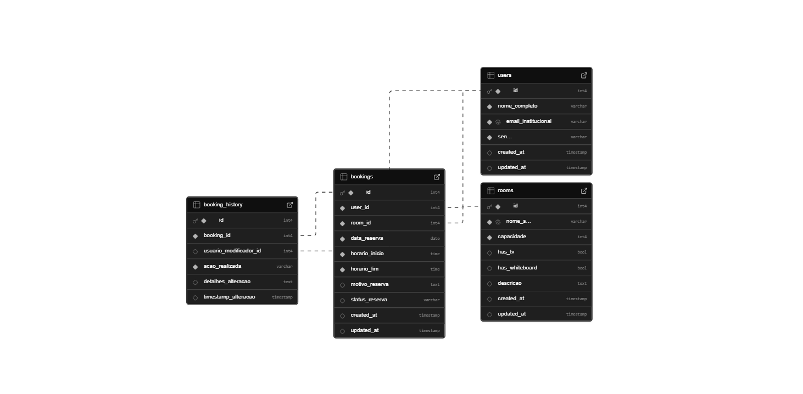

# Web Application Document - Projeto Individual - Módulo 2 - Inteli

**_Os trechos em itálico servem apenas como guia para o preenchimento da seção. Por esse motivo, não devem fazer parte da documentação final._**

## Nome do Projeto

#### Autor do projeto

## Sumário

1. [Introdução](#c1)  
2. [Visão Geral da Aplicação Web](#c2)  
3. [Projeto Técnico da Aplicação Web](#c3)  
4. [Desenvolvimento da Aplicação Web](#c4)  
5. [Referências](#c5)  

<br>

## <a name="c1"></a>1. Introdução:

&nbsp;&nbsp;&nbsp;&nbsp;No contexto inovador do INTELI – Instituto de Tecnologia e Liderança –, onde os projetos acadêmicos refletem diretamente os desafios e demandas do mundo real, este projeto individual propõe o desenvolvimento de um sistema web voltado à reserva de salas para agendamentos. A proposta busca atender, de forma direta, uma necessidade recorrente vivida por alunos da instituição: o uso eficiente, organizado e transparente dos espaços compartilhados no campus.

&nbsp;&nbsp;&nbsp;&nbsp;A plataforma será inteiramente desenvolvida como uma aplicação web responsiva, permitindo que usuários visualizem em tempo real a disponibilidade das salas, façam reservas com base em critérios personalizados (como horário, capacidade, e recursos da sala, como projetores ou lousas) e tenham controle centralizado sobre suas reservas. Isso garante não apenas agilidade no processo, mas também evita conflitos de agendamento e amplia a autonomia dos usuários.

&nbsp;&nbsp;&nbsp;&nbsp;Num primeiro momento, o escopo do projeto será focado em uma implementação funcional básica com banco de dados relacional, backend com APIs REST e frontend interativo. A visão a longo prazo, no entanto, é que o sistema possa ser adotado pelo próprio INTELI como solução para a gestão das salas de reunião existentes em seu campus. Com uma infraestrutura acadêmica moderna de mais de 10 mil m² e múltiplos espaços de convivência, estudo e trabalho colaborativo, a instituição demanda soluções tecnológicas sob medida que acompanhem sua missão de formar líderes através da inovação.
Assim, o projeto alia teoria, prática e propósito institucional, promovendo impacto real e potencial de escalabilidade. Mais que um exercício acadêmico, trata-se de uma aplicação com valor tangível e pronta para ser apresentada como case em processos seletivos e oportunidades profissionais.


---

## <a name="c2"></a>2. Visão Geral da Aplicação Web

### 2.1. Personas:

<div align="center">
<sub>Figura 01 - Persona 01
<br>
<br>
  

  
<sup>Fonte: Material produzido pelo autor (2025)
</div>
<br>

### 2.2. User Stories:

&nbsp;&nbsp;&nbsp;&nbsp;**US01 |** Como estudante do INTELI, quero visualizar em tempo real a disponibilidade das salas, para que eu possa escolher um horário conveniente sem risco de conflito com outras reservas.

&nbsp;&nbsp;&nbsp;&nbsp;**US02 |** Como usuário do sistema, quero realizar reservas filtrando por data, horário, capacidade da sala e recursos disponíveis, para que eu encontre um ambiente adequado às necessidades da minha reunião ou estudo em grupo.

&nbsp;&nbsp;&nbsp;&nbsp;**US03 |** Como estudante, quero acessar uma área pessoal com minhas reservas futuras e passadas, para que eu possa acompanhar, modificar ou cancelar agendamentos conforme minhas demandas mudam.

<br>

**Análise INVEST – User Story US02:**

&nbsp;&nbsp;&nbsp;&nbsp;**US02 |** Como usuário do sistema, quero realizar reservas filtrando por data, horário, capacidade da sala e recursos disponíveis, para que eu encontre um ambiente adequado às necessidades da minha reunião ou estudo em grupo.


&nbsp;&nbsp;&nbsp;&nbsp;**I – Independente:**
Essa User Story pode ser implementada de forma isolada, sem depender diretamente da criação da área pessoal ou visualização de histórico. O filtro e a reserva são funcionalidades autônomas que não exigem que outras partes estejam completamente prontas para funcionar.

&nbsp;&nbsp;&nbsp;&nbsp;**N – Negociável:**
O escopo da filtragem pode ser discutido com os stakeholders. É possível negociar, por exemplo, quais filtros serão priorizados (capacidade, data, recursos, hora) ou se todos precisam estar disponíveis logo na entrega final.

&nbsp;&nbsp;&nbsp;&nbsp;**V – Valiosa:**
Essa funcionalidade agrega valor direto ao usuário, pois garante que ele possa reservar um espaço adequado às suas necessidades. Isso evita frustrações com salas inadequadas e melhora a experiência geral do sistema.

&nbsp;&nbsp;&nbsp;&nbsp;**E – Estimável:**
É possível estimar com clareza o esforço necessário para desenvolver essa funcionalidade. A complexidade pode ser dividida entre a criação do frontend dos filtros, a lógica no backend e a estrutura de dados necessária no banco.

&nbsp;&nbsp;&nbsp;&nbsp;**S – Pequena (Small):**
A User Story é suficientemente pequena para ser entregue em um único ciclo de desenvolvimento. Caso necessário, pode até ser decomposta (ex: primeiro implementar filtro por data e horário, depois adicionar por capacidade e recursos).

&nbsp;&nbsp;&nbsp;&nbsp;**T – Testável:**
É possível validar se a funcionalidade está funcionando corretamente através de testes simples: selecionar filtros específicos e verificar se as salas exibidas condizem com os critérios escolhidos.

---

## <a name="c3"></a>3. Projeto da Aplicação Web

### 3.1. Modelagem do banco de dados:

&nbsp;&nbsp;&nbsp;&nbsp;O sistema de reservas de salas foi modelado para atender às necessidades operacionais e acadêmicas da comunidade do INTELI. A modelagem considera três atores principais: os usuários (que realizam reservas), as salas (disponíveis com recursos variados) e o histórico de alterações (para rastreabilidade). O foco do projeto é garantir integridade, rastreabilidade e evitar conflitos de horário entre as reservas.

O modelo contempla quatro entidades principais:

- Users (Usuários que realizam e alteram reservas);

- Rooms (Salas disponíveis para uso, com descrição e recursos embutidos por atributos booleanos);

- Bookings (Reservas realizadas com data, horário, motivo e status da reserva);

- Booking_History (Histórico de alterações em reservas, incluindo o usuário que modificou, ação e data).

**Modelo Lógico (Relacional):**

&nbsp;&nbsp;&nbsp;&nbsp;As relações entre as entidades estão representadas da seguinte forma:

``` text
[Users] -----< [Bookings] >----- [Rooms]
      \             |
       \            v
        --> [Booking_History]
```

- Um usuário pode fazer várias reservas;

- Uma sala pode ser reservada por vários usuários, em diferentes datas e horários;

- Cada reserva pode registrar alterações realizadas por outros usuários (ex: administradores ou responsáveis), garantindo rastreabilidade no histórico;

- Os atributos booleanos das salas substituem a necessidade de uma tabela separada de recursos, simplificando a modelagem.

&nbsp;&nbsp;&nbsp;&nbsp;A integridade referencial é garantida com o uso de chaves estrangeiras (FK) conectando usuários, salas e reservas. Além disso, foram criadas constraints de exclusividade e verificação para evitar reservas simultâneas e horários inválidos, além de triggers para atualização automática de timestamps.

**Modelo Físico (DDL - Script SQL):**

&nbsp;&nbsp;&nbsp;&nbsp;Abaixo está o esquema completo do banco de dados, pronto para ser executado no Supabase ou em qualquer banco PostgreSQL:

``` sql
-- 1. TABELA: users
CREATE TABLE IF NOT EXISTS users (
    id SERIAL PRIMARY KEY, -- PK
    nome_completo VARCHAR(255) NOT NULL,
    email_institucional VARCHAR(255) NOT NULL UNIQUE,
    senha VARCHAR(255) NOT NULL,
    created_at TIMESTAMP DEFAULT CURRENT_TIMESTAMP,
    updated_at TIMESTAMP DEFAULT CURRENT_TIMESTAMP
);

-- 2. TABELA: rooms
CREATE TABLE IF NOT EXISTS rooms (
    id SERIAL PRIMARY KEY, -- PK
    nome_sala VARCHAR(100) NOT NULL UNIQUE,
    capacidade INTEGER NOT NULL CHECK (capacidade > 0),
    has_tv BOOLEAN DEFAULT FALSE,
    has_whiteboard BOOLEAN DEFAULT FALSE,
    descricao TEXT,
    created_at TIMESTAMP DEFAULT CURRENT_TIMESTAMP,
    updated_at TIMESTAMP DEFAULT CURRENT_TIMESTAMP
);

-- 3. TABELA: bookings
CREATE TABLE IF NOT EXISTS bookings (
    id SERIAL PRIMARY KEY, -- PK
    user_id INTEGER NOT NULL, -- FK → users(id)
    room_id INTEGER NOT NULL, -- FK → rooms(id)
    data_reserva DATE NOT NULL,
    horario_inicio TIME NOT NULL,
    horario_fim TIME NOT NULL,
    motivo_reserva TEXT,
    status_reserva VARCHAR(50) DEFAULT 'confirmada' CHECK (
        status_reserva IN ('confirmada', 'cancelada', 'concluida', 'pendente')
    ),
    created_at TIMESTAMP DEFAULT CURRENT_TIMESTAMP,
    updated_at TIMESTAMP DEFAULT CURRENT_TIMESTAMP,
    CONSTRAINT fk_user_booking FOREIGN KEY (user_id) REFERENCES users(id) ON DELETE CASCADE,
    CONSTRAINT fk_room_booking FOREIGN KEY (room_id) REFERENCES rooms(id) ON DELETE CASCADE,
    CONSTRAINT chk_horario_fim_maior_inicio CHECK (horario_fim > horario_inicio),
    CONSTRAINT unique_user_active_booking_per_day EXCLUDE (
        user_id WITH =, data_reserva WITH =
    ) WHERE (status_reserva IN ('confirmada', 'pendente'))
);

-- 4. TABELA: booking_history
CREATE TABLE IF NOT EXISTS booking_history (
    id SERIAL PRIMARY KEY, -- PK
    booking_id INTEGER NOT NULL, -- FK → bookings(id)
    usuario_modificador_id INTEGER, -- FK → users(id)
    acao_realizada VARCHAR(255) NOT NULL,
    detalhes_alteracao TEXT,
    timestamp_alteracao TIMESTAMP DEFAULT CURRENT_TIMESTAMP,
    CONSTRAINT fk_booking_history FOREIGN KEY (booking_id) REFERENCES bookings(id) ON DELETE CASCADE,
    CONSTRAINT fk_modificador FOREIGN KEY (usuario_modificador_id) REFERENCES users(id)
);

-- 5. ÍNDICES (Para Desempenho)
CREATE INDEX IF NOT EXISTS idx_bookings_user_id ON bookings(user_id);
CREATE INDEX IF NOT EXISTS idx_bookings_room_id ON bookings(room_id);
CREATE INDEX IF NOT EXISTS idx_bookings_data_reserva ON bookings(data_reserva);
CREATE INDEX IF NOT EXISTS idx_booking_history_booking_id ON booking_history(booking_id);

-- 6. Função e triggers para updated_at automático
CREATE OR REPLACE FUNCTION update_updated_at_column()
RETURNS TRIGGER AS $$
BEGIN
   NEW.updated_at = NOW();
   RETURN NEW;
END;
$$ language 'plpgsql';

CREATE TRIGGER trg_users_updated_at
BEFORE UPDATE ON users
FOR EACH ROW EXECUTE PROCEDURE update_updated_at_column();

CREATE TRIGGER trg_rooms_updated_at
BEFORE UPDATE ON rooms
FOR EACH ROW EXECUTE PROCEDURE update_updated_at_column();

CREATE TRIGGER trg_bookings_updated_at
BEFORE UPDATE ON bookings
FOR EACH ROW EXECUTE PROCEDURE update_updated_at_column();
```

**Diagrama Relacional (ERD):**

<div align="center">
<sub>Figura 02 - Diagrama Relacional
<br>
<br>
  

  
<sup>Fonte: Material produzido pelo autor (2025)
</div>
<br>

### 3.1.1 BD e Models (Semana 5)
*Descreva aqui os Models implementados no sistema web*

### 3.2. Arquitetura (Semana 5)

*Posicione aqui o diagrama de arquitetura da sua solução de aplicação web. Atualize sempre que necessário.*

**Instruções para criação do diagrama de arquitetura**  
- **Model**: A camada que lida com a lógica de negócios e interage com o banco de dados.
- **View**: A camada responsável pela interface de usuário.
- **Controller**: A camada que recebe as requisições, processa as ações e atualiza o modelo e a visualização.
  
*Adicione as setas e explicações sobre como os dados fluem entre o Model, Controller e View.*

<br>

### 3.1.1 BD e Models (Semana 5)
*Descreva aqui os Models implementados no sistema web*

### 3.2. Arquitetura (Semana 5)

*Posicione aqui o diagrama de arquitetura da sua solução de aplicação web. Atualize sempre que necessário.*

**Instruções para criação do diagrama de arquitetura**  
- **Model**: A camada que lida com a lógica de negócios e interage com o banco de dados.
- **View**: A camada responsável pela interface de usuário.
- **Controller**: A camada que recebe as requisições, processa as ações e atualiza o modelo e a visualização.
  
*Adicione as setas e explicações sobre como os dados fluem entre o Model, Controller e View.*

<br>

### 3.3. Wireframes

Nesta seção, é apresentado os wireframes desenvolvidos para o sistema de Reserva de Salas do INTELI. Os wireframes focam na estrutura, navegação e disposição dos elementos da interface do usuário, refletindo as funcionalidades essenciais para uma experiência de usuário intuitiva e eficiente. O design prioriza a clareza e a facilidade de uso, garantindo que os usuários possam realizar suas tarefas de forma rápida e sem ambiguidades. As telas foram concebidas para atender às necessidades identificadas, proporcionando um fluxo lógico e coeso através das diversas funcionalidades do sistema.

É importante ressaltar que os wireframes apresentados são de baixa fidelidade, concentrando-se na arquitetura da informação e na funcionalidade, sem detalhamento de cores, estilos visuais finais, tipografias específicas ou imagens realistas, conforme as boas práticas de desenvolvimento de wireframes nesta fase do projeto. O objetivo principal é validar a estrutura e o fluxo de navegação antes de avançar para etapas de design de alta fidelidade.

As telas obrigatórias, como a tela principal de uso e telas de interação com funcionalidades centrais, estão contempladas. A seguir, cada wireframe é apresentado com uma descrição detalhada de seus componentes e a lógica de interação proposta.

### 3.3.1 Tela de Login

**Link do Figma:**

&nbsp;&nbsp;&nbsp;&nbsp; Abaixo está o link do Figma para a consulta dos Wireframes.

https://www.figma.com/design/8Yfo0P6Ow169ZiPUmhe3Be/Sistema-Reservas?node-id=0-1&p=f&m=draw

<div align="center">
<sub>Figura 03 - Tela de Login
<br>
<br>
  

  
<sup>Fonte: Material produzido pelo autor (2025)
</div>
<br>

**Descrição:** A tela de login é a porta de entrada para o sistema, garantindo que apenas usuários autenticados tenham acesso às funcionalidades. Ela apresenta campos para inserção de email e senha, além de um botão para "Entrar". Há também um link para cadastro de novos usuários.

**Elementos:**

*   **Campo de Email:** Permite ao usuário inserir seu endereço de email cadastrado.
*   **Campo de Senha:** Permite ao usuário inserir sua senha.
*   **Botão "Entrar":** Ao ser clicado, valida as credenciais e, se corretas, direciona o usuário para a tela principal do sistema (Dashboard).
*   **Link "Cadastre-se":** Leva o usuário para a tela de cadastro, permitindo a criação de uma nova conta.

**Fluxo de Interação:**

1.  O usuário acessa a tela de login.
2.  Insere seu email e senha nos campos correspondentes.
3.  Clica no botão "Entrar".
4.  O sistema verifica as credenciais.
5.  Se as credenciais estiverem corretas, o usuário é redirecionado para a tela principal (Dashboard).
6.  Se as credenciais estiverem incorretas, uma mensagem de erro é exibida, e o usuário permanece na tela de login.
7.  Caso o usuário não possua uma conta, ele pode clicar no link "Cadastre-se" para ser direcionado à tela de cadastro.

**User Stories Atendidas:**

*   Como usuário, eu quero poder me logar no sistema para acessar minhas informações e funcionalidades.
*   Como novo usuário, eu quero poder me cadastrar no sistema para começar a utilizá-lo.

### 3.3.2 Tela de Cadastro de Usuário

<div align="center">
<sub>Figura 04 - Tela de Login
<br>
<br>
  

  
<sup>Fonte: Material produzido pelo autor (2025)
</div>
<br>

**Descrição:** A tela de cadastro permite que novos usuários criem uma conta no sistema, fornecendo informações básicas para identificação e acesso.

**Elementos:**

*   **Campo "Nome Completo":** Para o usuário inserir seu nome completo.
*   **Campo "Email Institucional":** Para o usuário inserir seu email institucional, que será usado como login.
*   **Campo "Senha":** Para o usuário definir uma senha para sua conta.
*   **Campo "Confirmar Senha":** Para o usuário confirmar a senha digitada anteriormente, garantindo que não houve erros de digitação.
*   **Botão "Cadastrar":** Submete os dados do formulário para criar a nova conta.
*   **Link "Já tem uma conta? Faça login aqui.":** Redireciona o usuário para a tela de login, caso ele já possua uma conta.

**Fluxo de Interação:**

1.  O usuário acessa a tela de cadastro.
2.  Preenche os campos de nome completo, email institucional, senha e confirmação de senha.
3.  Clica no botão "Cadastrar".
4.  O sistema valida os dados (ex: se o email já está cadastrado, se as senhas coincidem).
5.  Se os dados forem válidos, a conta é criada, e o usuário é redirecionado para a tela de login ou diretamente para o dashboard.
6.  Se houver erros (ex: email já cadastrado, senhas não coincidem), mensagens de erro são exibidas, e o usuário permanece na tela de cadastro para corrigir as informações.

**User Stories Atendidas:**

*   Como novo usuário, eu quero poder me cadastrar no sistema para ter acesso às suas funcionalidades.
*   Como usuário, quero que o sistema valide meus dados de cadastro para garantir a segurança e integridade das informações.

### 3.3.3 Tela Principal (Dashboard)

<div align="center">
<sub>Figura 05 - Tela de Dashboard
<br>
<br>
  

  
<sup>Fonte: Material produzido pelo autor (2025)
</div>
<br>

**Descrição:** A tela principal, ou Dashboard, é a primeira tela que o usuário visualiza após o login. Ela serve como um hub central, oferecendo acesso rápido às principais funcionalidades do sistema e exibindo informações relevantes.

**Elementos:**

*   **Barra de Navegação Superior:** Contém o logo do sistema ("INTELI SALAS") que serve como um botão de home e botões de navegação como "Salas" e "Minhas Reservas". Também pode incluir um ícone de perfil do usuário e um botão de logout (pode ser implementado). Além disso, existe as palavras "Login", "Cadastro" e "Salas" que são botões interativos que levam respectivamente para as telas que elas se remetem.
*   **Mensagem de Boas-Vindas:** Uma saudação personalizada ao usuário.
*   **Botões de Ação Rápida:**
    *   **"Ver Salas Disponíveis":** Leva o usuário para a tela de busca e reserva de salas.
    *   **"Minhas Reservas":** Leva o usuário para uma tela onde ele pode visualizar e gerenciar suas reservas existentes e reservas já feitas anteriormente.
*   **Seção de Notificações/Avisos:** Uma área para exibir informações importantes, como manutenções programadas, novas funcionalidades ou lembretes de reservas. (Pode ser implementado algum dia)
*   **Rodapé:** Pode conter informações de copyright e links para termos de serviço ou política de privacidade. (Se for necessário)

**Fluxo de Interação:**

1.  Após o login bem-sucedido, o usuário é direcionado para o Dashboard.
2.  O usuário pode visualizar informações gerais e ter acesso rápido às principais funcionalidades através dos botões de navegação.
3.  Clicar em "Ver Salas Disponíveis" redireciona para a tela de busca de salas.
4.  Clicar em "Minhas Reservas" redireciona para a tela de gerenciamento de reservas do usuário.
5.  A navegação principal no topo da página permite acesso a outras seções do sistema, das respectivas telas que as palavras se referem.

**User Stories Atendidas:**

*   Como usuário logado, quero ter uma visão geral das funcionalidades disponíveis no sistema.
*   Como usuário, quero poder navegar facilmente para as seções de busca de salas e gerenciamento das minhas reservas.

### 3.3.4 Tela de Busca de Salas (Exemplo de Funcionalidade Principal)

<div align="center">
<sub>Figura 06 - Tela de Busca de Salas
<br>
<br>
  

  
<sup>Fonte: Material produzido pelo autor (2025)
</div>
<br>

**Descrição:** Esta tela permite ao usuário buscar por salas disponíveis com base em critérios específicos, como data, horário, capacidade e recursos.

**Elementos Visuais Principais:**

*   **Filtros de Busca:**
    *   **Data:** Um campo para selecionar a data desejada para a reserva.
    *   **Horário de Início:** Um campo para selecionar o horário de início da reserva.
    *   **Horário de Fim:** Um campo para selecionar o horário de término da reserva.
    *   **Capacidade:** Um campo para especificar o número mínimo de pessoas que a sala deve comportar.
    *   **Recursos Adicionais:** Checkboxes ou um menu suspenso para selecionar recursos específicos (ex: lousa, tv).
*   **Botão de Busca:** Inicia a pesquisa com base nos filtros selecionados.
*   **Área de Resultados da Busca:** Exibe uma lista de salas que correspondem aos critérios de busca. Cada item da lista deve mostrar:
    *   Nome ou identificação da sala.
    *   Capacidade da sala.
    *   Recursos disponíveis na sala.
    *   Um botão ou link para "Reservar" a sala.

**Fluxo de Interação Típico:**

1.  O usuário acessa a tela de busca de salas (geralmente a partir do dashboard ou de um menu de navegação).
2.  O usuário preenche os campos de filtro de acordo com suas necessidades (data, horário, capacidade, recursos).
3.  O usuário clica no botão "Buscar Salas".
4.  O sistema processa a busca e exibe uma lista de salas disponíveis que atendem aos critérios.
5.  O usuário pode visualizar os detalhes de cada sala na lista (ex: fotos, descrição mais detalhada).
6.  O usuário seleciona uma sala e clica no botão "Reservar".
7.  O sistema pode levar o usuário para uma página de confirmação da reserva ou diretamente para uma tela de sucesso, dependendo do fluxo definido.

**Relação com as User Stories:**

Esta tela é crucial para múltiplas User Stories, como: "Como um usuário, quero poder buscar salas disponíveis especificando data, horário, capacidade e recursos necessários para encontrar a melhor opção para minha necessidade." e "Como um usuário, quero ver uma lista de salas disponíveis que correspondam aos meus critérios de busca, com informações claras sobre cada sala." O botão "Reservar" inicia a ação descrita em: "Como um usuário, quero poder reservar uma sala disponível diretamente a partir dos resultados da busca."

**Relação com a Persona (Cleber Alves):**

Esta tela é de importância vital para Cleber. Suas "Dores" incluem ter passado por conflitos de reserva e a falta de clareza sobre a disponibilidade de salas, além de sentir o processo atual como desorganizado. A "Tela de Busca Avançada e Listagem de Salas" ataca diretamente esses problemas ao:

*   **Oferecer Clareza na Disponibilidade:** Os filtros de data, horário, capacidade e recursos permitem que Cleber refine sua busca e veja apenas as salas que realmente atendem às suas necessidades e estão disponíveis, aliviando sua frustração com a incerteza.
*   **Agilizar o Processo de Agendamento:** A capacidade de buscar, ver detalhes e iniciar a reserva em uma única tela atende à sua "Motivação" de "agendar salas de forma rápida, centralizada e confiável".
*   **Prevenir Conflitos:** Ao mostrar apenas salas disponíveis e permitir a reserva direta, o sistema (suportado pelo backend) evita sobreposições, uma de suas principais "Dores".
*   **Atender Preferências de Uso:** A estrutura clara e objetiva da tela está alinhada com a preferência de Cleber por "sistemas simples, objetivos e acessíveis". Embora o wireframe seja desktop, a funcionalidade central é o que importa para ele.

Ao utilizar esta tela, Cleber pode otimizar sua rotina acadêmica, encontrando e reservando os espaços de que precisa sem o estresse e a informalidade do processo anterior.

### 3.3.5 Tela de Minhas Reservas

<div align="center">
<sub>Figura 07 - Tela de Minhas Reservas - Reservas Futuras
<br>
<br>
  

  
<sup>Fonte: Material produzido pelo autor (2025)
</div>
<br>

<div align="center">
<sub>Figura 08 - Tela de Minhas Reservas - Histórico de Reservas
<br>
<br>
  

  
<sup>Fonte: Material produzido pelo autor (2025)
</div>
<br>

**Descrição:** A tela "Minhas Reservas" oferece ao usuário uma visão consolidada de todas as suas reservas de salas, separadas em duas abas principais: "Reservas Futuras" e "Histórico de Reservas". Isso permite um gerenciamento eficiente e um acompanhamento claro do uso das salas pelo usuário, proporcionando controle e organização sobre seus agendamentos.

**Elementos Comuns:**

*   **Título da Tela: "Tela de Minhas Reservas":** Identifica claramente a seção do sistema.
*   **Abas de Navegação:**
    *   **"Reservas Futuras":** Aba que, ao ser selecionada, exibe as reservas agendadas que ainda não ocorreram.
    *   **"Histórico de Reservas":** Aba que, ao ser selecionada, exibe as reservas que já foram concluídas ou canceladas.

**Elementos da Aba "Reservas Futuras":**

*   **Título da Lista: "Lista de Reservas Futuras"**: Indica o conteúdo exibido na aba.
*   **Itens de Reserva Futura:** Cada item na lista representa uma reserva agendada e exibe:
    *   **Nome da Sala (ex: "Sala 1"):** Identificação clara da sala reservada.
    *   **Data da Reserva (ex: "21/02/2025"):** Data para a qual a sala está reservada.
    *   **Horário da Reserva (ex: "10:00 – 11:00"):** Período específico da reserva.
    *   **Status da Reserva (ex: "Status: Confirmada"):** Indica o estado atual da reserva (ex: Confirmada, Pendente).
    *   **Botão "Modificar":** Permite ao usuário acessar a "Tela de Modificação de Reserva" para alterar os detalhes da reserva (ex: data, horário), sujeito às regras de modificação do sistema e disponibilidade.
    *   **Botão "Cancelar":** Permite ao usuário cancelar a reserva.

**Elementos da Aba "Histórico de Reservas":**

*   **Título da Lista: "Lista de Histórico de Reservas"**: Indica o conteúdo exibido na aba.
*   **Itens de Histórico de Reserva:** Cada item na lista representa uma reserva passada e exibe:
    *   **Nome da Sala (ex: "Sala 2"):** Identificação da sala que foi reservada.
    *   **Data da Reserva (ex: "20/01/2025"):** Data em que a reserva ocorreu.
    *   **Horário da Reserva (ex: "09:00 – 10:00"):** Período em que a sala esteve reservada.
    *   **Status da Reserva (ex: "Status: Realizada"):** Indica o estado final da reserva (ex: Realizada, Cancelada, Não Compareceu).

**Fluxo de Interação:**

1.  O usuário acessa a tela "Minhas Reservas", geralmente a partir do Dashboard (botão "Minhas Reservas") ou de um link de navegação.
2.  Por padrão, a aba "Reservas Futuras" é exibida, listando as próximas reservas do usuário.
3.  Na aba "Reservas Futuras", para cada reserva, o usuário pode:
    *   Clicar em "Modificar" para ser direcionado à "Tela de Modificação de Reserva" daquela reserva específica.
    *   Clicar em "Cancelar" para iniciar o processo de cancelamento da reserva (o sistema deve solicitar uma confirmação).
4.  O usuário pode clicar na aba "Histórico de Reservas".
5.  A lista é atualizada para exibir as reservas passadas, com seus respectivos detalhes e status finais. Não há ações de modificação ou cancelamento para reservas no histórico.

**Relação com as User Stories:**

Esta tela é fundamental para várias User Stories, incluindo:
*   "Como um usuário, quero poder visualizar todas as minhas reservas futuras em um só lugar, com detalhes como sala, data, horário e status."
*   "Como um usuário, quero poder modificar os detalhes de uma reserva futura, como data ou horário, se necessário."
*   "Como um usuário, quero poder cancelar uma reserva futura se meus planos mudarem."
*   "Como um usuário, quero poder visualizar meu histórico de reservas passadas para referência."

**Relação com a Persona (Cleber Alves):**

A tela "Minhas Reservas" é essencial para Cleber, pois aborda diretamente várias de suas necessidades e dores:

*   **Organização e Controle:** Cleber "usa Notion, Google Calendar e Discord para se organizar". Ter uma visão centralizada de suas "Reservas Futuras" e "Histórico de Reservas" em um único local, com status claros, permite que ele mantenha o controle sobre seus agendamentos de salas, alinhando-se com seus hábitos digitais e necessidade de organização. A clareza das informações de data, hora e status da sala é crucial para ele.
*   **Agilidade e Autonomia:** A possibilidade de "Modificar" ou "Cancelar" uma reserva futura diretamente pela tela confere a Cleber a autonomia e rapidez que ele valoriza em sistemas ("prefere sistemas simples, objetivos e acessíveis"). Isso evita processos burocráticos ou informais que ele percebe como uma "Dor" no sistema atual, que é "desorganizado e informal".
*   **Clareza e Confiança:** A visualização clara do status ("Confirmada", "Realizada") e dos detalhes de cada reserva contribui para a "confiança" que ele busca ao "agendar salas de forma rápida, centralizada e confiável". Isso mitiga a "falta de clareza sobre a disponibilidade de salas" e a sensação de um processo desorganizado.
*   **Otimização da Rotina:** Ao gerenciar suas reservas de forma eficiente, Cleber pode "otimizar sua rotina acadêmica", um dos benefícios que a "Solução" proposta visa entregar a ele. Ter um histórico também o ajuda a lembrar de salas que ele gostou de usar ou padrões de uso.

Esta funcionalidade, portanto, não apenas atende aos requisitos funcionais, mas também melhora significativamente a experiência de Cleber, tornando o gerenciamento de suas reservas de sala uma tarefa simples, confiável e alinhada com suas expectativas de um sistema eficiente.

### 3.3.6 Tela de Modificação de Reserva

<div align="center">
<sub>Figura 08 - Tela de Minhas Reservas - Histórico de Reservas
<br>
<br>
  

  
<sup>Fonte: Material produzido pelo autor (2025)
</div>
<br>

**Descrição:** A tela de Modificação de Reserva permite ao usuário alterar os detalhes de uma reserva existente que ainda não ocorreu. O objetivo é oferecer flexibilidade, permitindo ajustes na reserva (como data, horário ou, potencialmente, a sala) conforme a necessidade do usuário, sempre sujeito às políticas do sistema e à disponibilidade da sala no novo horário/data desejado.

**Elementos:**

*   **Título da Tela: "Modificação de Reserva":** Indica claramente a finalidade da tela.
*   **Campo "Sala":** Exibe o nome da sala atualmente reservada (ex: "Sala 1"). O wireframe apresenta este campo com uma seta para baixo, sugerindo que pode ser um seletor (dropdown). Se for um seletor, permitiria ao usuário tentar trocar de sala, o que exigiria uma nova verificação de disponibilidade para a nova sala no horário desejado. Caso contrário, se a troca de sala não for permitida nesta tela, seria um campo de texto não editável exibindo a sala original.
*   **Campo "Data":** Um campo de entrada, pré-preenchido com a data atual da reserva (ex: "19/02/2025"). Possui um ícone de calendário, indicando que um seletor de data (datepicker) está disponível para o usuário escolher uma nova data para a reserva.
*   **Campo "Hora":** Um campo de entrada, pré-preenchido com o horário atual da reserva (ex: "09:00 – 10:00"). Possui um ícone de relógio, indicando que um seletor de horário (timepicker) está disponível para o usuário escolher um novo período (início e fim) para a reserva.
*   **Botão "Salvar":** Um botão de ação primário. Ao ser clicado, submete as alterações propostas para validação. O sistema verificará a disponibilidade da sala (a mesma ou uma nova, dependendo da implementação do campo "Sala") para a nova data/horário. Se disponível e as alterações forem válidas conforme as regras de negócio (ex: antecedência mínima para modificação), a reserva é atualizada.
*   **Botão "Cancelar":** Um botão de ação secundário. Ao ser clicado, descarta quaisquer alterações feitas nos campos e retorna o usuário à tela anterior (provavelmente a tela "Minhas Reservas - Futuras"), sem salvar as modificações.

**Fluxo de Interação:**

1.  O usuário chega a esta tela após clicar no botão "Modificar" de uma reserva específica na tela "Minhas Reservas - Futuras".
2.  Os campos ("Sala", "Data", "Hora") são pré-preenchidos com os detalhes da reserva atual.
3.  O usuário pode interagir com os campos para propor alterações:
    *   **Sala:** Se for um seletor, o usuário pode tentar selecionar uma nova sala.
    *   **Data:** O usuário clica no campo ou no ícone de calendário para abrir um seletor e escolher uma nova data.
    *   **Hora:** O usuário clica no campo ou no ícone de relógio para abrir um seletor e escolher um novo horário de início e fim.
4.  Após fazer as modificações desejadas, o usuário clica no botão "Salvar".
5.  O sistema realiza as seguintes validações:
    *   Verifica a disponibilidade da sala (original ou nova) para a nova data e horário.
    *   Verifica se a modificação respeita as regras de negócio (ex: antecedência mínima, duração máxima/mínima da reserva).
6.  **Cenário de Sucesso:** Se a modificação for possível e todas as validações passarem, a reserva é atualizada no sistema. O usuário é notificado do sucesso (por exemplo, com uma mensagem de confirmação) e é redirecionado de volta para a tela "Minhas Reservas", onde a reserva aparecerá com os detalhes atualizados.
7.  **Cenário de Falha:** Se a modificação não for possível (ex: sala indisponível no novo horário, violação de regra de negócio), uma mensagem de erro clara é exibida na tela, explicando o motivo. O usuário permanece na tela de modificação, com os valores alterados ainda presentes, para que possa tentar outros horários/datas ou cancelar a alteração.
8.  Se o usuário clicar no botão "Cancelar" a qualquer momento, nenhuma alteração é salva, e ele é retornado à tela "Minhas Reservas - Futuras".

**Relação com as User Stories:**

Esta tela atende diretamente à User Story: "Como um usuário, quero poder modificar os detalhes de uma reserva futura, como sala, data ou horário, se houver disponibilidade e conforme as políticas do sistema." A validação de disponibilidade e o respeito às políticas do sistema são aspectos cruciais implícitos nesta história e refletidos no fluxo de interação.

**Relação com a Persona (Cleber Alves):**

A tela de "Modificação de Reserva" é particularmente relevante para Cleber, pois oferece a flexibilidade e o controle que ele valoriza e que suprem suas dores atuais:

*   **Adaptação à Rotina Dinâmica:** A vida de um estudante como Cleber pode ser imprevisível, com mudanças de horários de aulas ou compromissos. A necessidade de alterar uma reserva de sala (data, hora ou até mesmo a sala, se o sistema permitir e houver disponibilidade) é uma realidade. Esta tela permite que ele faça esses ajustes de forma autônoma, o que se alinha com sua preferência por "sistemas simples, objetivos e acessíveis" e sua necessidade de "otimizar sua rotina acadêmica".
*   **Redução de Estresse e Burocracia:** Em um sistema "desorganizado e informal" (uma de suas "Dores" com o processo atual), modificar uma reserva poderia ser um processo complicado, demorado e sujeito a falhas. A tela de modificação oferece uma maneira "rápida, centralizada e confiável" de gerenciar mudanças, o que é uma de suas "Motivações" e parte da "Solução" que o sistema visa oferecer.
*   **Autonomia e Confiança:** Poder modificar seus próprios agendamentos, com feedback imediato sobre a disponibilidade (implícito no fluxo de salvar e validar), aumenta a confiança de Cleber no sistema e em sua capacidade de gerenciar seus compromissos sem depender de intermediários ou processos manuais.
*   **Prevenção de Problemas e Conflitos:** Ao permitir que Cleber ajuste suas reservas de forma proativa, o sistema ajuda a evitar que salas fiquem reservadas e não utilizadas, ou que ele precise cancelar e refazer todo o processo por uma pequena alteração, o que poderia levar a novos "conflitos de reserva" ou perda de tempo. Isso contribui para evitar as "Dores" que ele já vivenciou.

Para Cleber, que "ama usar as salas de reunião" e busca eficiência, a capacidade de modificar uma reserva de forma descomplicada e transparente é um diferencial importante, tornando o sistema mais útil, adaptado às suas necessidades reais como estudante do INTELI e reforçando a percepção de um sistema estruturado e confiável.

### 3.4. Guia de estilos (Semana 05)

*Descreva aqui orientações gerais para o leitor sobre como utilizar os componentes do guia de estilos de sua solução.*


### 3.5. Protótipo de alta fidelidade (Semana 05)

*Posicione aqui algumas imagens demonstrativas de seu protótipo de alta fidelidade e o link para acesso ao protótipo completo (mantenha o link sempre público para visualização).*

### 3.6. WebAPI e endpoints (Semana 05)

*Utilize um link para outra página de documentação contendo a descrição completa de cada endpoint. Ou descreva aqui cada endpoint criado para seu sistema.*  

### 3.7 Interface e Navegação (Semana 07)

*Descreva e ilustre aqui o desenvolvimento do frontend do sistema web, explicando brevemente o que foi entregue em termos de código e sistema. Utilize prints de tela para ilustrar.*

---

## <a name="c4"></a>4. Desenvolvimento da Aplicação Web (Semana 8)

### 4.1 Demonstração do Sistema Web (Semana 8)

*VIDEO: Insira o link do vídeo demonstrativo nesta seção*
*Descreva e ilustre aqui o desenvolvimento do sistema web completo, explicando brevemente o que foi entregue em termos de código e sistema. Utilize prints de tela para ilustrar.*

### 4.2 Conclusões e Trabalhos Futuros (Semana 8)

*Indique pontos fortes e pontos a melhorar de maneira geral.*
*Relacione também quaisquer outras ideias que você tenha para melhorias futuras.*


## <a name="c5"></a>5. Referências

_Incluir as principais referências de seu projeto, para que seu parceiro possa consultar caso ele se interessar em aprofundar. Um exemplo de referência de livro e de site:_<br>

---
---
